# Lab 01 - Mise en place du lab (Mobexler + snapshot clean)

## Objectif
Mettre en place un environnement isolé et reproductible 
pour les labs de sécurité mobile Android.

## Environnement
- OS Hôte : Windows 11
- Hyperviseur : VMware Workstation Pro 17
- VM : Mobexler (Ubuntu-based, 4GB RAM, 70GB disk)
- Emulateur Android : Genymotion Desktop v3.10.0 PRO
- Device virtuel : Genymotion Phone_2 - Android 10 API 29

## Etapes réalisées

### 1. Import de Mobexler dans VMware
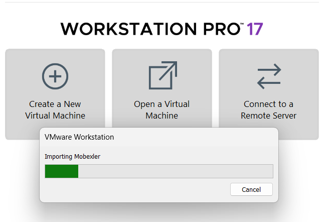

### 2. Configuration réseau
- Network Adapter 1 : NAT (accès Internet)
- Network Adapter 2 : Host-Only (réseau lab)

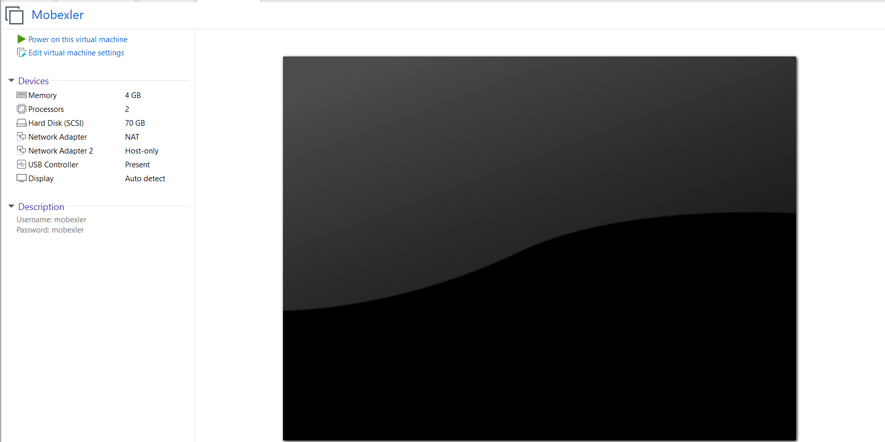

### 3. Premier démarrage
- Login : mobexler / mobexler

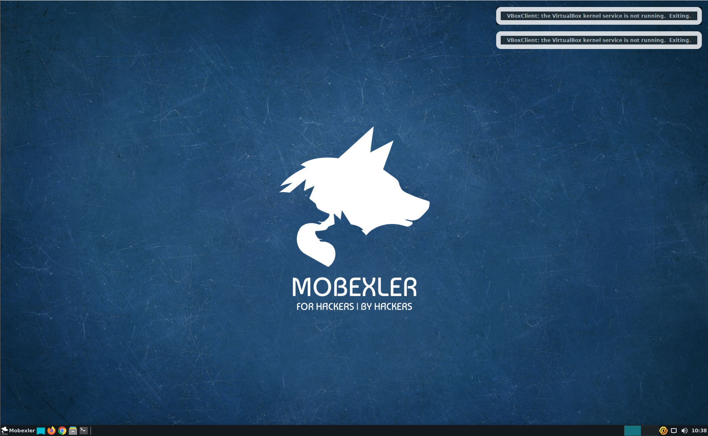
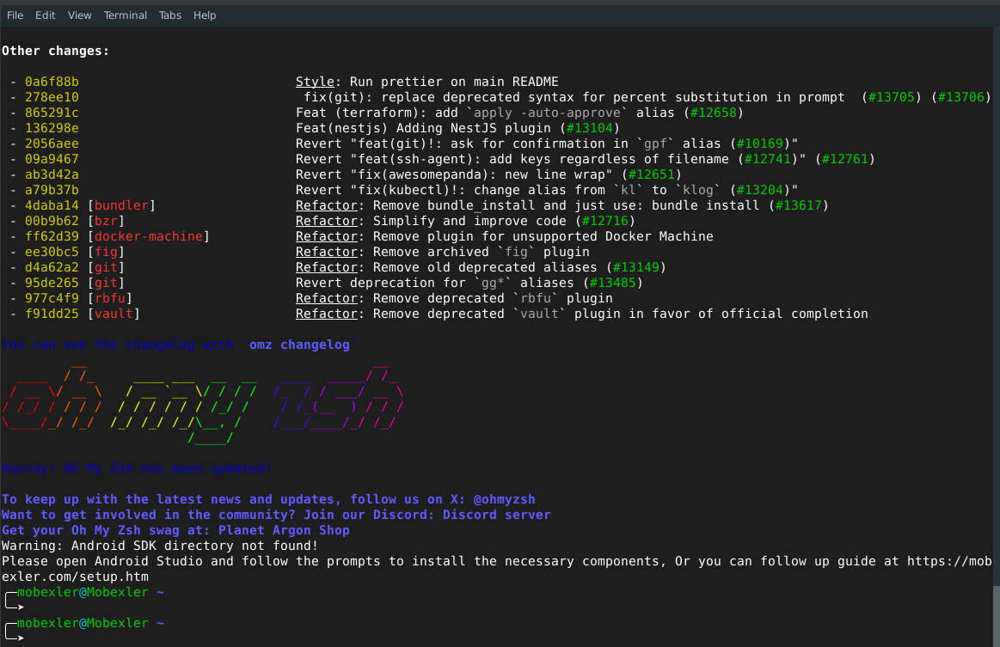

### 4. Verification réseau
```bash
ip a
ping -c 2 8.8.8.8
ping -c 2 google.com
```
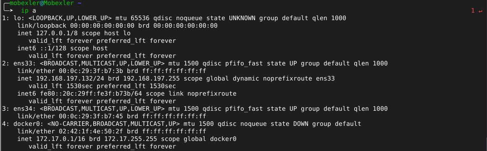
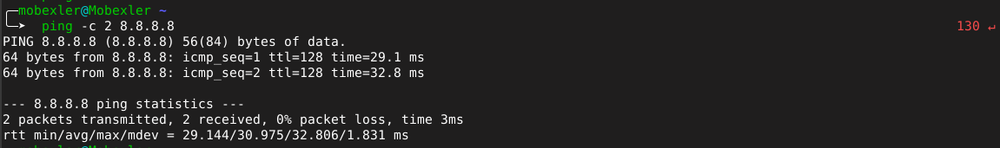
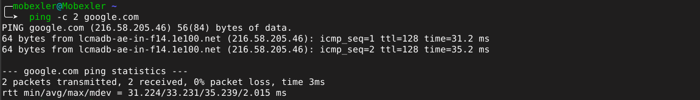

### 5. Snapshot CLEAN
- Nom : CLEAN_BASELINE_TP1
- Description : Import OK, NAT+HostOnly OK, boot OK, prêt ADB

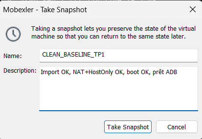

### 6. Installation Genymotion et connexion ADB
```bash
cd "C:\Users\hiba\AppData\Local\Android\Sdk\platform-tools"
.\adb connect 169.254.175.101:5555
.\adb devices
```
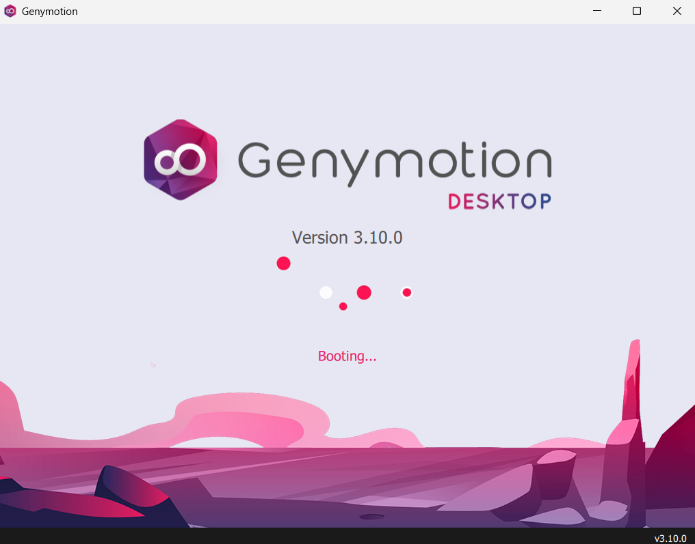
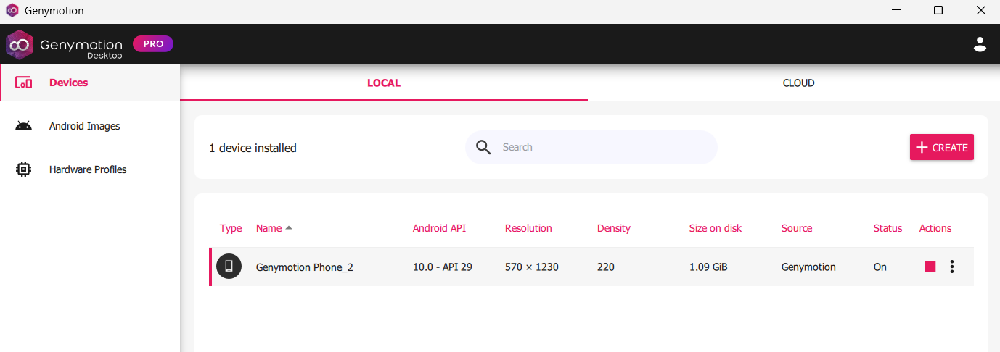
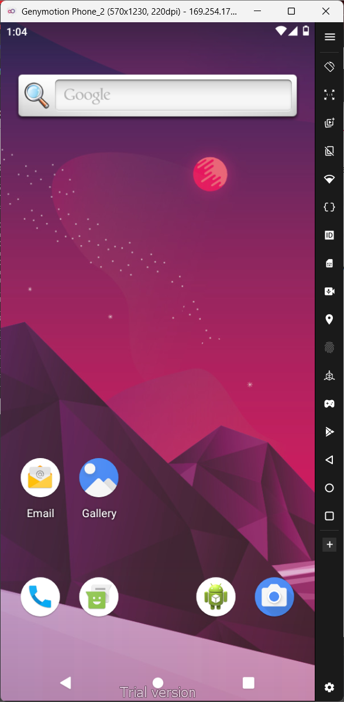
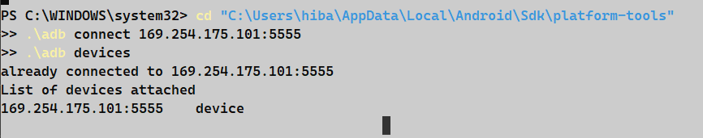

## Difficultés rencontrées
- Genymotion imposait Android 15 par défaut, 
  incompatible avec les outils de sécurité
- Conflit DHCP VirtualBox entre les deux 
  adaptateurs Host-Only (même sous-réseau 192.168.56.x)
- Hyper-V actif via WSL empêchait VirtualBox 
  de démarrer correctement
- Solution : désactivation de Hyper-V via 
  `bcdedit /set hypervisorlaunchtype off`

## Conclusion
Environnement opérationnel :
- Mobexler accessible via VMware
- Genymotion Phone_2 (Android 10 API 29) démarré
- ADB connecté sur 169.254.175.101:5555
- Snapshot CLEAN disponible pour restauration
