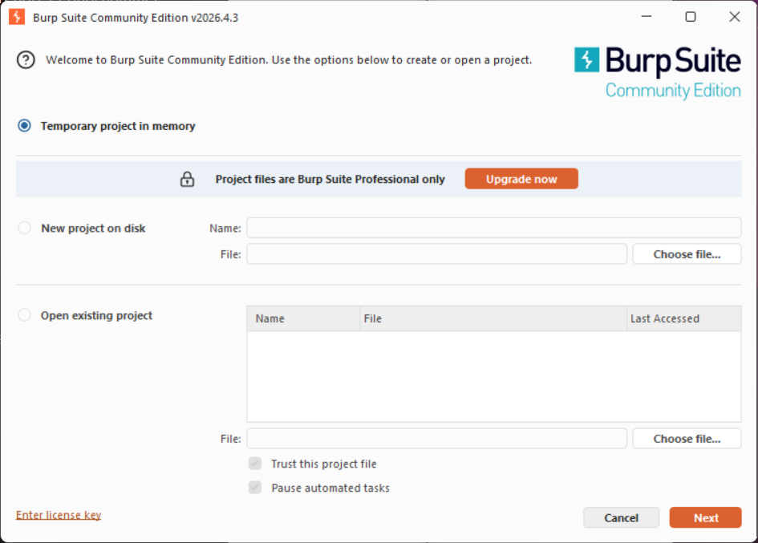
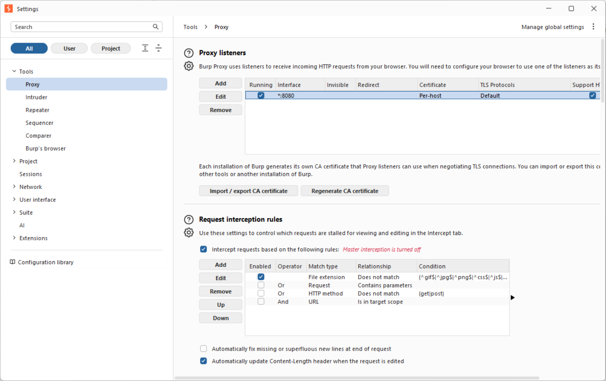
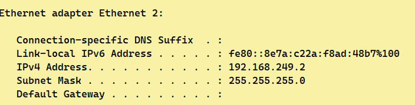
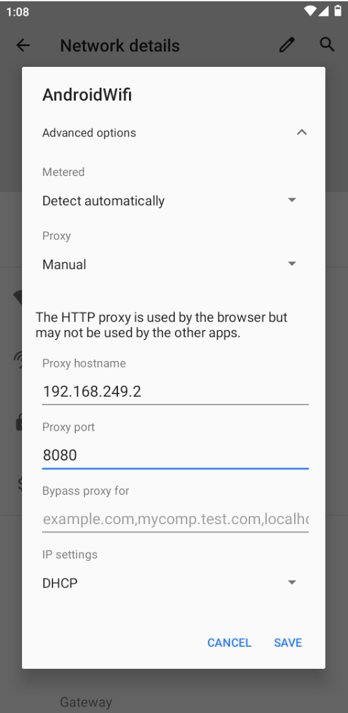
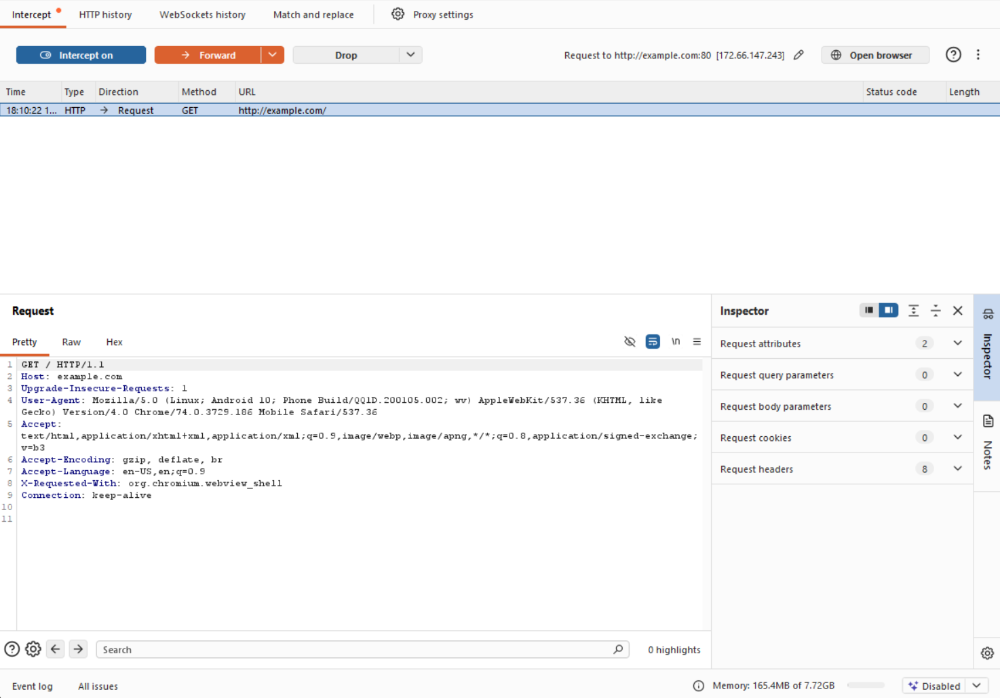
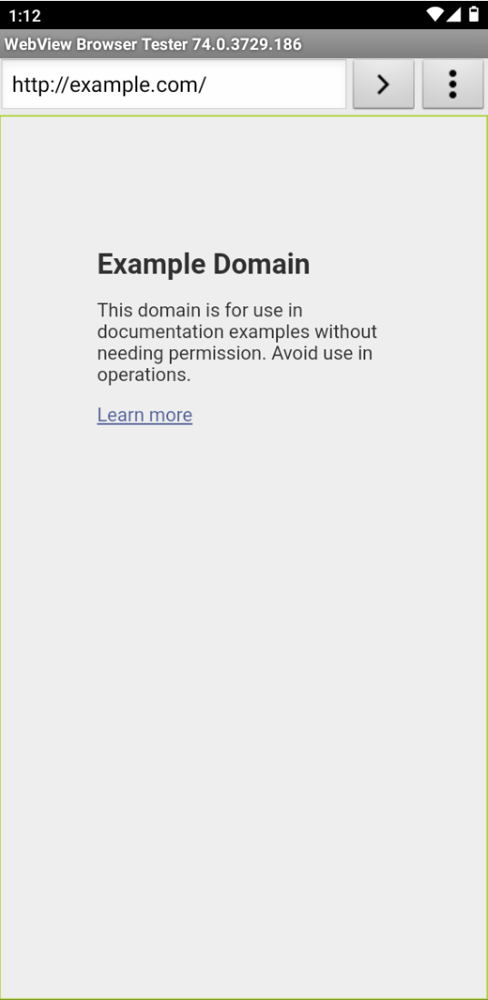

# Lab 03 - Observation du trafic HTTP(S) Android avec Burp Suite

## Objectif
Mettre en place un proxy d'observation entre un émulateur Android
et une application cible pour capturer et analyser le trafic HTTP.

## Environnement
- OS Hôte : Windows 11
- Proxy : Burp Suite Community
- Emulateur : Genymotion Phone_2 (Android 10 - API 29)
- IP hôte : 192.168.249.2
- Port proxy : 8080

## Architecture réseau
Genymotion (192.168.249.101)
↓ proxy configuré
Burp Suite (192.168.249.2:8080)
↓
Internet

## Etapes réalisées

### 1. Préparation de Burp Suite
- Projet temporaire créé
- Interception désactivée (Intercept is off)
- Listener configuré sur All interfaces:8080



### 2. Configuration du Proxy Listener
- Port : 8080
- Adresse : All interfaces



### 3. Identification de l'IP hôte
```bash
ipconfig
# IP retenue : 192.168.249.2 (Ethernet 2)
```


### 4. Configuration du proxy dans Genymotion
- Paramètres WiFi → Proxy Manual
- Hostname : 192.168.249.2
- Port : 8080



### 5. Test de capture HTTP
- Navigation vers http://example.com
- Requêtes capturées dans Burp HTTP history


### 6. Analyse d'une requête interceptée
- Méthode : GET
- URL : http://example.com/
- Headers : Host, User-Agent, Accept



### 7. Page chargée après transmission


## Observations

| Élément | Valeur | Risque |
|---|---|---|
| URL complète | http://example.com/ | Faible |
| User-Agent | Android WebView | Faible |
| Cookies | Aucun | N/A |

## Risques identifiés

| # | Risque | Sévérité |
|---|---|---|
| 1 | HTTP non chiffré | Élevée |
| 2 | Absence d'en-têtes de sécurité | Moyenne |
| 3 | User-Agent révèle l'environnement | Faible |

## Recommandations
- Utiliser HTTPS pour toutes les communications
- Implémenter le SSL Pinning
- Sécuriser les cookies (Secure + HttpOnly)
- Ajouter des en-têtes de sécurité HSTS

## Outils utilisés
`Burp Suite` `Genymotion` `Android 10` `VMware`

## Difficultés rencontrées
- Identification de la bonne interface réseau parmi
  les nombreuses interfaces VMware/VirtualBox

## Conclusion
Lab réalisé avec succès.
