# Lab 04 - Analyse statique d'un APK avec JADX GUI + dex2jar + JD-GUI

## Objectif

Analyser statiquement l'application OWASP UnCrackable Level 1 sans l'exécuter,
afin d'identifier des vulnérabilités et retrouver le secret caché dans le code source décompilé.

## Environnement

| Composant | Valeur |
|-----------|--------|
| OS Hôte | Windows 11 |
| VM | Mobexler (VMware Workstation Pro 17) |
| APK cible | OWASP UnCrackable-Level1.apk |
| Outil principal | JADX GUI |
| Outil secondaire | dex2jar + JD-GUI 1.6.6 |

## APK analysé

| Propriété | Valeur |
|-----------|--------|
| Nom | UnCrackable-Level1.apk |
| Package | owasp.mstg.uncrackable1 |
| Version | 1.0 |
| SHA-256 | `1da8bf57d266109f9a07c01bf7111a1975ce01f190b9d914bcd3ae3dbef96f21` |
| minSdk | 19 |
| targetSdk | 28 |

## Etapes réalisées

### Task 1 — Préparation du workspace

Création du dossier de travail et vérification de l'APK.

```bash
mkdir ~/APK-Analysis
cd ~/APK-Analysis
hexdump -n 4 UnCrackable-Level1.apk   # Vérifie la signature ZIP : 4b 50 (PK)
sha256sum UnCrackable-Level1.apk
```

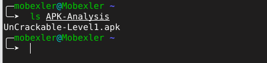
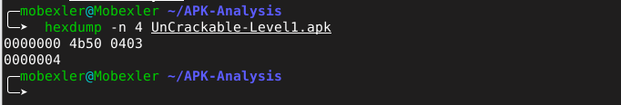
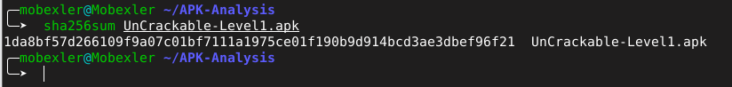

### Task 2 — Source de l'APK

APK obtenu depuis le site officiel OWASP MASTG :
https://mas.owasp.org/crackmes/ — application volontairement vulnérable à des fins pédagogiques.

### Task 3 — Analyse avec JADX GUI

Lancement de JADX GUI et ouverture de l'APK :

```bash
jadx-gui
```

Structure de l'APK identifiée dans JADX :

```
owasp.mstg.uncrackable1/
├── MainActivity
├── R
sg.vantagepoint/
├── a/          ← Chiffrement AES
├── uncrackable1/
│   ├── a       ← Vérification du secret
│   ├── b       ← Détection du mode debug
│   └── c       ← Détection du root (3 méthodes)
```

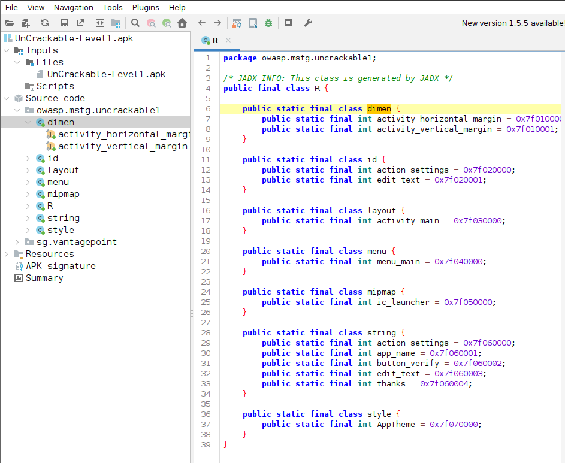

**Analyse du AndroidManifest.xml :**

| Attribut | Valeur | Risque |
|----------|--------|--------|
| package | owasp.mstg.uncrackable1 | - |
| versionName | 1.0 | - |
| minSdkVersion | 19 | - |
| targetSdkVersion | 28 | - |
| android:allowBackup | true | Moyen |
| Permissions déclarées | Aucune | - |
| Activity exportée (intent-filter) | MainActivity | Moyen |

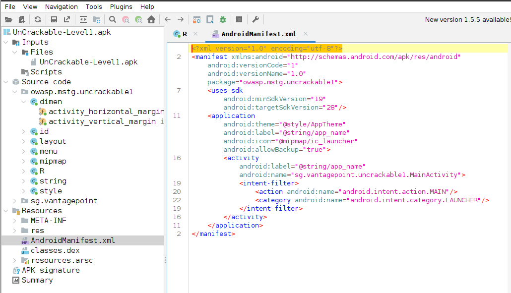

**Analyse de MainActivity :**

Trois protections détectées dans `onCreate()` :

```java
if (c.a() || c.b() || c.c())   // Détection root
    a("Root detected!");
if (b.a(getApplicationContext()))  // Détection debug
    a("App is debuggable!");
```

Logique de vérification du secret dans `verify()` :

```java
if (a.a(obj))
    alertDialog.setTitle("Success!");
else
    alertDialog.setTitle("Nope...");
```

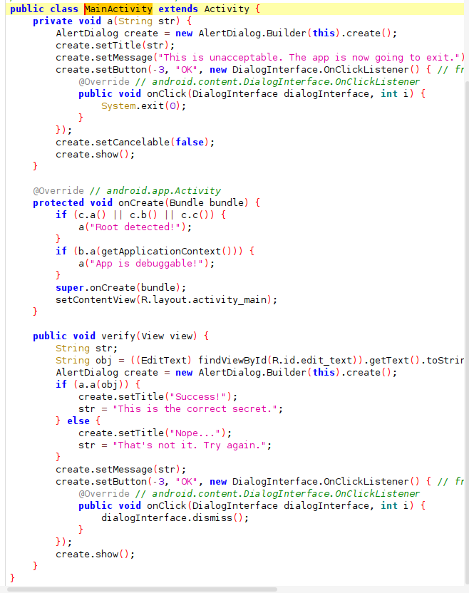

### Task 4 — Recherche de chaînes sensibles

**Classe sg.vantagepoint.a (chiffrement AES) :**

```java
SecretKeySpec secretKeySpec = new SecretKeySpec(bArr, "AES/ECB/PKCS7Padding");
Cipher cipher = Cipher.getInstance("AES");
```

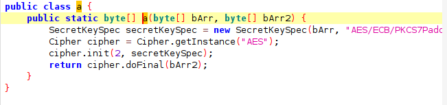

**Classe sg.vantagepoint.uncrackable1.a (vérification du secret) :**

```java
bArr = sg.vantagepoint.a.a.a(
    b("8d127684cbc37c17616d806cf50473cc"),    // Clé AES hardcodée
    Base64.decode("5UJiFctbmgbDoLXmpL12mkno8HT4Lv8dlat8FxR2GOc=", 0)  // Secret chiffré
);
```

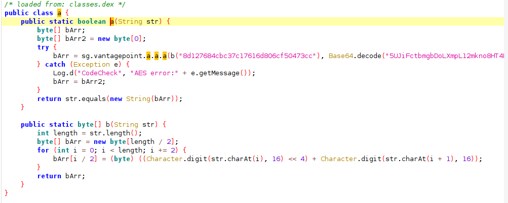

**Classe sg.vantagepoint.b (détection debug) :**

```java
return (context.getApplicationContext().getApplicationInfo().flags & 2) != 0;
```

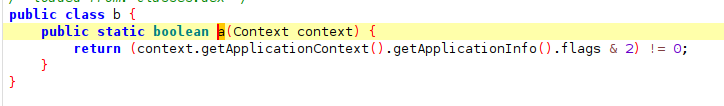

**Classe sg.vantagepoint.c (détection root — 3 méthodes) :**

```java
// Méthode a : cherche le binaire su dans le PATH
// Méthode b : vérifie Build.TAGS contient "test-keys"
// Méthode c : cherche les fichiers Superuser.apk, daemonsu, etc.
```

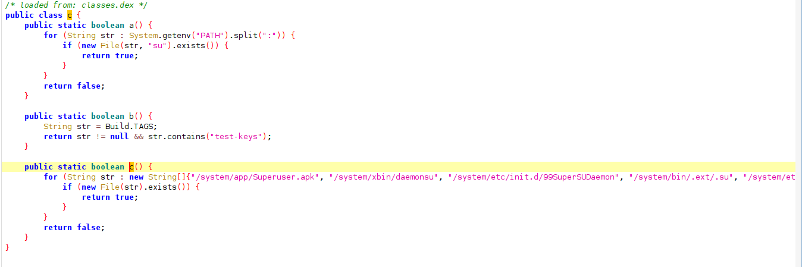

**Déchiffrement du secret :**

```python
import base64
from Crypto.Cipher import AES

key = bytes.fromhex('8d127684cbc37c17616d806cf50473cc')
encrypted = base64.b64decode('5UJiFctbmgbDoLXmpL12mkno8HT4Lv8dlat8FxR2GOc=')
cipher = AES.new(key, AES.MODE_ECB)
print(cipher.decrypt(encrypted))
# Résultat : b'I want to believe\x0f\x0f...'
```

**Secret retrouvé : `I want to believe`**

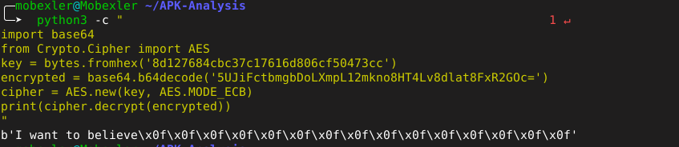

### Task 5 — Conversion DEX vers JAR avec dex2jar

```bash
d2j-dex2jar ~/APK-Analysis/UnCrackable-Level1.apk
ls ~/APK-Analysis
# Résultat : UnCrackable-Level1-dex2jar.jar
```

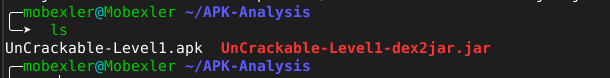

### Task 6 — Comparaison JADX vs JD-GUI

```bash
java -jar ~/Downloads/jd-gui-1.6.6.jar ~/APK-Analysis/UnCrackable-Level1-dex2jar.jar
```

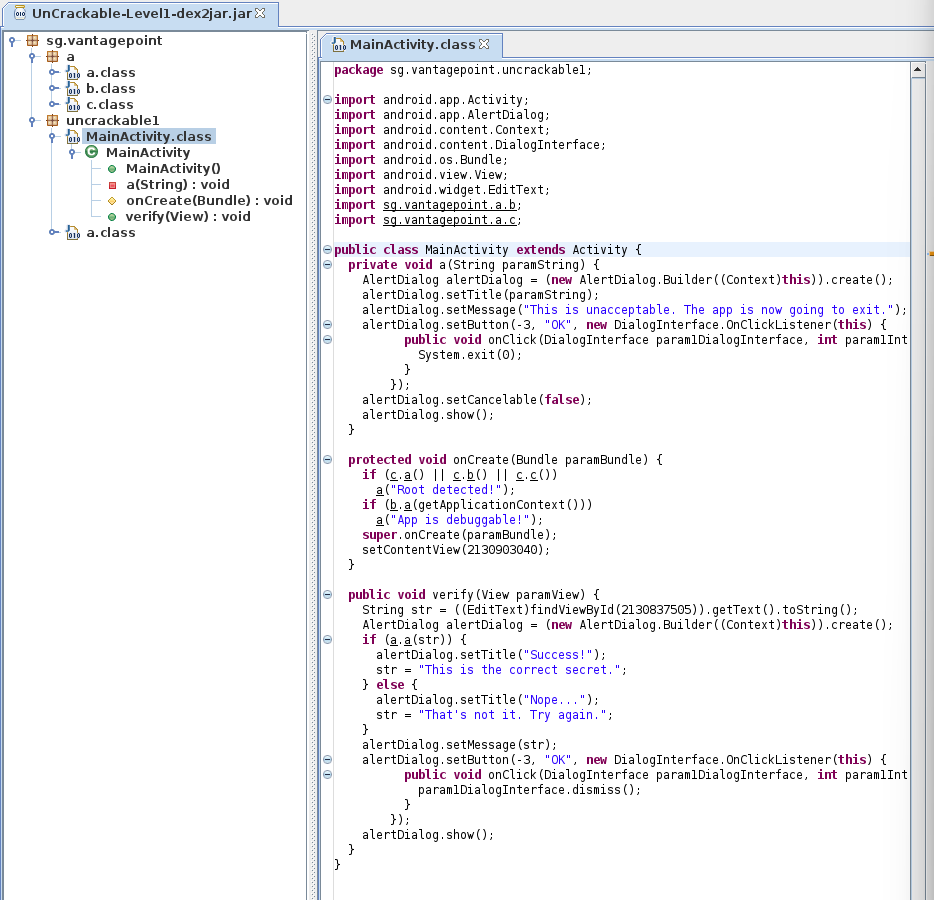

| Aspect | JADX GUI | JD-GUI |
|--------|----------|--------|
| Navigation | Structure Android complète (Manifest, Resources, Code) | Structure Java uniquement (packages, classes) |
| Ressources | Accès direct au AndroidManifest.xml et XML | Pas d'accès aux ressources Android |
| Lisibilité du code | Annotations Android préservées | Code plus brut, annotations perdues |
| Kotlin | Bonne gestion | Syntaxe parfois illisible |
| Obfuscation | Tente de reconstruire les noms | Conserve les noms obfusqués |
| Usage recommandé | Analyse complète d'APK Android | Analyse rapide de bytecode Java |

**Conclusion :** JADX GUI est plus adapté pour l'analyse Android complète. JD-GUI reste utile pour une lecture rapide du bytecode Java converti.

## Vulnérabilités identifiées

| # | Vulnérabilité | Sévérité | Localisation |
|---|---------------|----------|--------------|
| 1 | Clé AES codée en dur dans le code source | Elevée | sg.vantagepoint.uncrackable1.a |
| 2 | Secret chiffré stocké dans le binaire | Elevée | sg.vantagepoint.uncrackable1.a |
| 3 | Algorithme AES/ECB (mode non sécurisé) | Elevée | sg.vantagepoint.a |
| 4 | android:allowBackup="true" | Moyenne | AndroidManifest.xml |
| 5 | Détection root contournable statiquement | Moyenne | sg.vantagepoint.c |

## Difficultés rencontrées

- JD-GUI non préinstallé dans Mobexler, installation manuelle via Firefox nécessaire
- Clavier en QWERTY par défaut, changé en FR avec `setxkbmap fr`
- Copier-coller non disponible entre l'hôte Windows et Mobexler

## Conclusion

L'analyse statique de UnCrackable Level 1 a permis de retrouver le secret `I want to believe`
sans exécuter l'application. Les principales vulnérabilités sont liées au stockage de secrets
cryptographiques directement dans le code source, une pratique à éviter absolument en production.
