# Lab 06 - Analyse statique d'un APK avec MobSF dans la VM Mobexler

## Objectif

Analyser statiquement l'application OWASP UnCrackable Level 1 à l'aide de MobSF
(Mobile Security Framework), un outil d'analyse automatisée open-source, afin
d'identifier les vulnérabilités sans exécuter l'application.

## Environnement

| Composant | Valeur |
|-----------|--------|
| OS Hôte | Windows 11 |
| VM | Mobexler (VMware Workstation Pro 17) |
| Outil | MobSF v4.5.0 (via Docker) |
| APK cible | OWASP UnCrackable-Level1.apk |
| SHA-256 | `1da8bf57d266109f9a07c01bf7111a1975ce01f190b9d914bcd3ae3dbef96f21` |

## Etapes réalisées

### Task 1 — Préparation du workspace

```bash
mkdir -p ~/apk_analysis/$(date +%Y-%m-%d)
cd ~/apk_analysis/$(date +%Y-%m-%d)
cp ~/APK-Analysis/UnCrackable-Level1.apk ./
sha256sum UnCrackable-Level1.apk > apk_hash.txt
cat apk_hash.txt
```

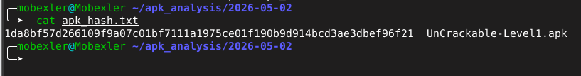

### Task 2 — Lancement de MobSF via Docker

```bash
sudo docker images | grep mobsf
sudo docker run -it --rm -p 8000:8000 \
  opensecurity/mobile-security-framework-mobsf:latest
```

MobSF v4.5.0 démarre sur `http://127.0.0.1:8000` avec les credentials `mobsf/mobsf`.

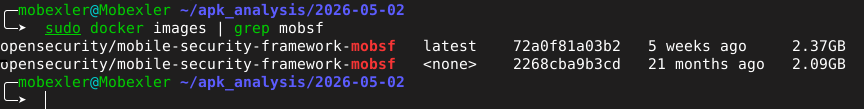
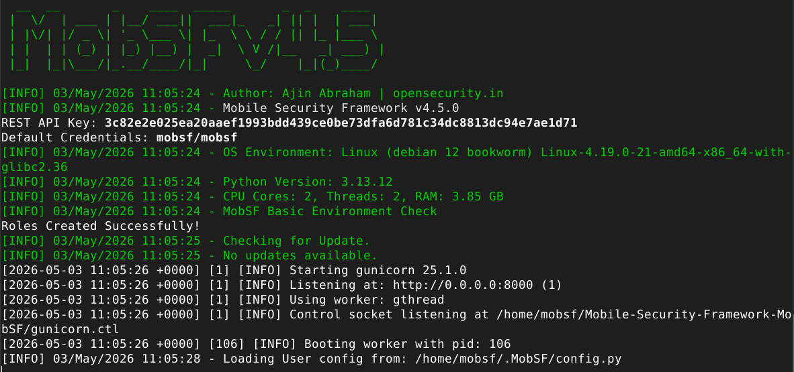
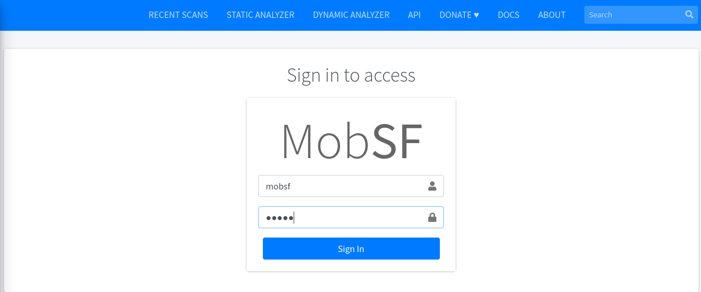
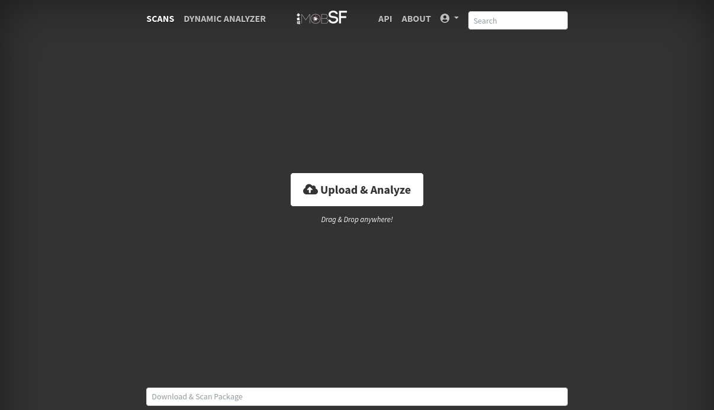

### Task 3 — Import et analyse de l'APK

Upload de `UnCrackable-Level1.apk` via le bouton "Upload & Analyze".

Résultats de l'analyse :

| Propriété | Valeur |
|-----------|--------|
| App Name | Uncrackable1 |
| Package | owasp.mstg.uncrackable1 |
| Version | 1.0 |
| Target SDK | 28 |
| Min SDK | 19 |
| Security Score | **55/100 (MEDIUM RISK) — Grade B** |
| Trackers | 0/432 |

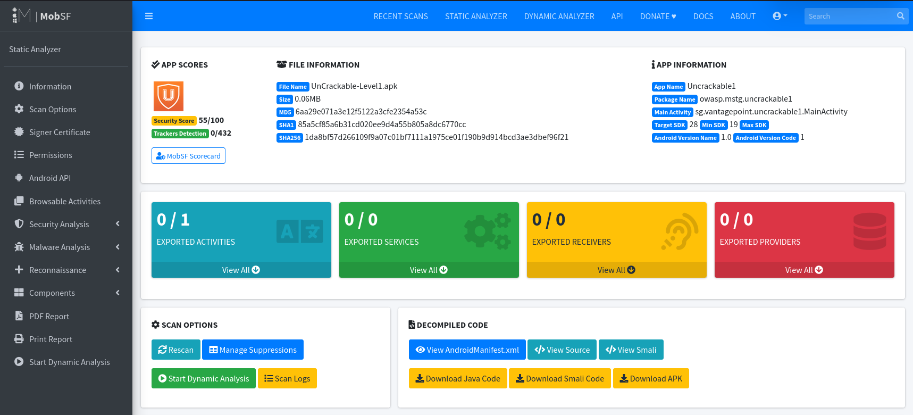

### Task 4 — Analyse du manifeste et des permissions

**Permissions déclarées :** Aucune

**Certificat de signature :**
- Signataire : OWASP / Jeroen Willemsen
- Algorithme : RSA 2048 bits / SHA-256
- Validité : 2018 → 2043

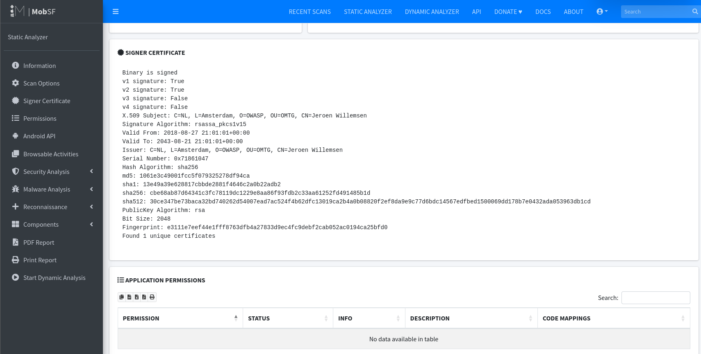

### Task 5 — Certificate Analysis

| # | Problème | Sévérité |
|---|---------|----------|
| 1 | Vulnérable à Janus (signature v1 uniquement) | Warning |
| 2 | Application signée avec certificat de code | Info |

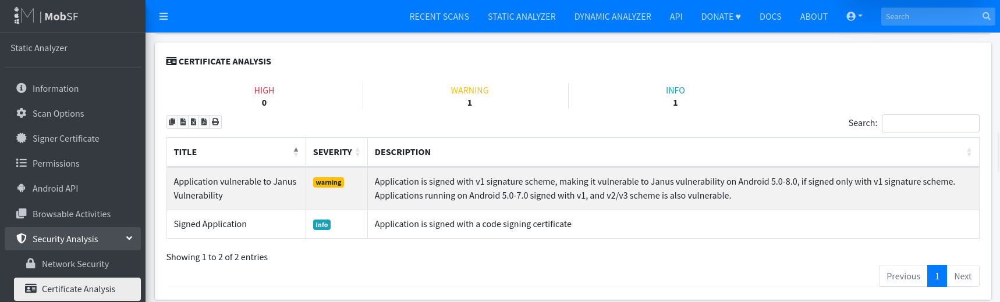

### Task 6 — Analyse du code et des ressources

**Manifest Analysis :**

| # | Problème | Sévérité |
|---|---------|----------|
| 1 | minSdk=19 — Android 4.4 vulnérable non patché | **High** |
| 2 | android:allowBackup=true | Warning |

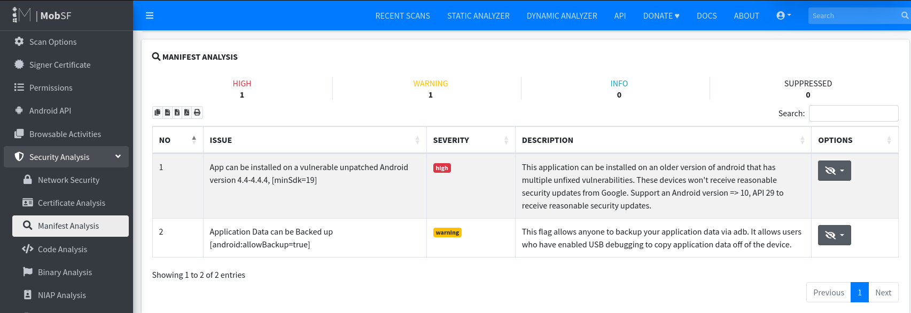

**Code Analysis :**

| # | Vulnérabilité | Sévérité | MASVS |
|---|--------------|----------|-------|
| 1 | App may request root privileges | Warning | MSTG-RESILIENCE-1 |
| 2 | Root detection capabilities | Secure | MSTG-RESILIENCE-1 |
| 3 | AES ECB mode — algorithme cryptographique faible | **High** | MSTG-CRYPTO-2 |
| 4 | App logs sensitive information | Info | MSTG-STORAGE-3 |

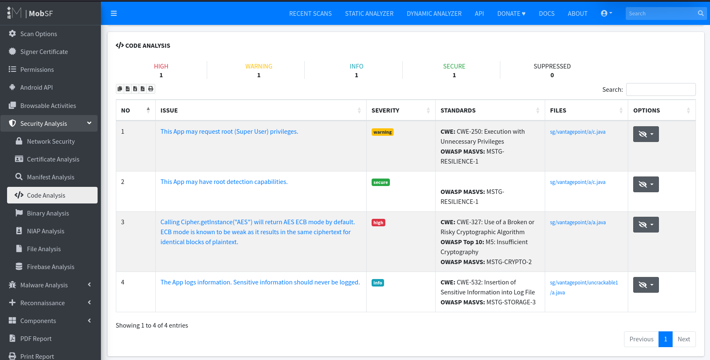

**Strings sensibles détectés :**

- Clé AES hardcodée : `8d127684cbc37c17616d806cf50473cc`
- Secret chiffré Base64 : `5UJiFctbmgbDoLXmpL12mkno8HT4Lv8dlat8FxR2GOc=`
- Algorithme : `AES/ECB/PKCS7Padding`

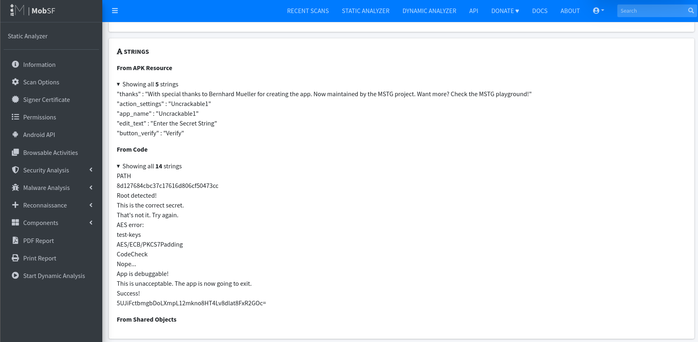

### Task 8 — Export du rapport PDF

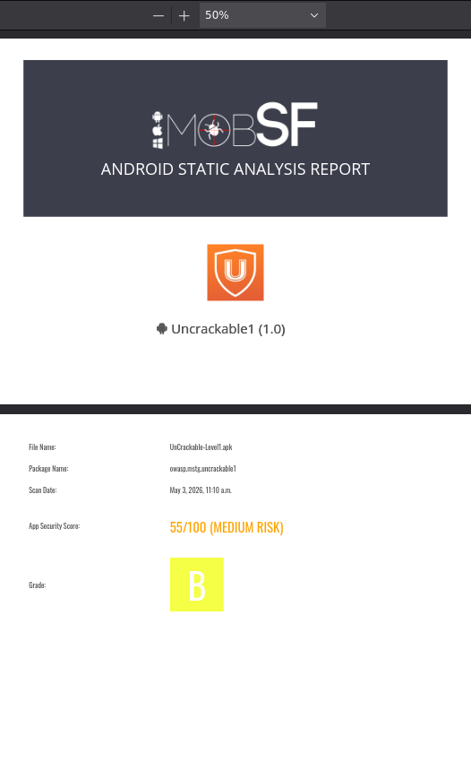

## Comparaison MobSF vs JADX GUI

| Critère | MobSF | JADX GUI |
|---------|-------|----------|
| Analyse | Automatisée | Manuelle |
| Score de sécurité | Oui (55/100) | Non |
| Référencement MASVS | Automatique | Manuel |
| Détection secrets | Automatique | Recherche manuelle |
| Profondeur d'analyse | Moyenne | Elevée |
| Faux positifs | Possible | Contrôlés |

## Difficultés rencontrées

- MobSF non préinstallé dans Mobexler — installation via Docker nécessaire
- Clavier QWERTY par défaut dans Mobexler — changé avec `setxkbmap fr`

## Conclusion

MobSF a automatiquement identifié les mêmes vulnérabilités que l'analyse manuelle
du Lab 04, avec en plus le référencement OWASP MASVS et un score global de **55/100**.
L'outil confirme les 3 vulnérabilités critiques : clé AES hardcodée, mode ECB faible,
et allowBackup activé.
