# Lab 07 - Analyse Dynamique Mobile avec MobSF

## Objectif

Ce lab vise à réaliser une analyse dynamique de l'application InsecureBankv2
en utilisant MobSF (Mobile Security Framework). Contrairement à l'analyse statique,
l'analyse dynamique observe le comportement de l'application **en cours d'exécution**,
permettant de capturer le trafic réseau, les fichiers créés, les logs runtime
et les appels de méthodes via instrumentation Frida.

## Environnement

| Composant | Valeur |
|-----------|--------|
| OS Hôte | Windows 11 |
| VM | Mobexler (VMware Workstation Pro 17) |
| Emulateur | Genymotion Phone_2 - Android 10 API 29 |
| Outil d'analyse | MobSF v4.5.0 (via Docker) |
| APK cible | InsecureBankv2.apk (3.3MB) |
| SHA-256 | `b18af2a0e44d7634bbcdf93664d9c78a2695e050393fcfbb5e8b91f902d194a4` |

## Etapes réalisées

### Etape 1 — Connexion ADB et démarrage de MobSF

Avant de lancer MobSF, l'émulateur Genymotion doit être démarré et connecté
via ADB. MobSF a besoin de connaître l'identifiant du device pour piloter
l'analyse dynamique — c'est pourquoi on passe la variable
`MOBSF_ANALYZER_IDENTIFIER` lors du lancement Docker.

```bash
adb connect 169.254.79.101:5555
adb devices

sudo docker run -it --rm -p 8000:8000 \
  -e MOBSF_ANALYZER_IDENTIFIER="169.254.79.101:5555" \
  opensecurity/mobile-security-framework-mobsf:latest
```

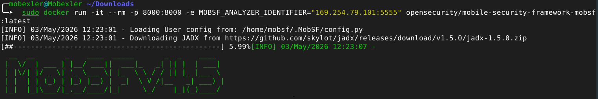

**Observation :** Le device Genymotion apparaît avec le statut `device`,
confirmant que ADB peut communiquer avec l'émulateur. MobSF utilisera
cette connexion pour installer l'APK et injecter Frida automatiquement.

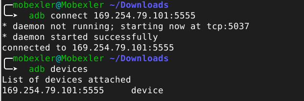

**Observation :** MobSF v4.5.0 démarre en téléchargeant JADX et en chargeant
la configuration utilisateur. La variable `MOBSF_ANALYZER_IDENTIFIER` est
visible dans la commande, garantissant que MobSF cible le bon émulateur.

### Etape 2 — Analyse statique préliminaire d'InsecureBankv2

Avant l'analyse dynamique, MobSF effectue une analyse statique complète
de l'APK pour établir une baseline des vulnérabilités. InsecureBankv2
est une application bancaire volontairement vulnérable conçue pour
les tests de sécurité mobile.

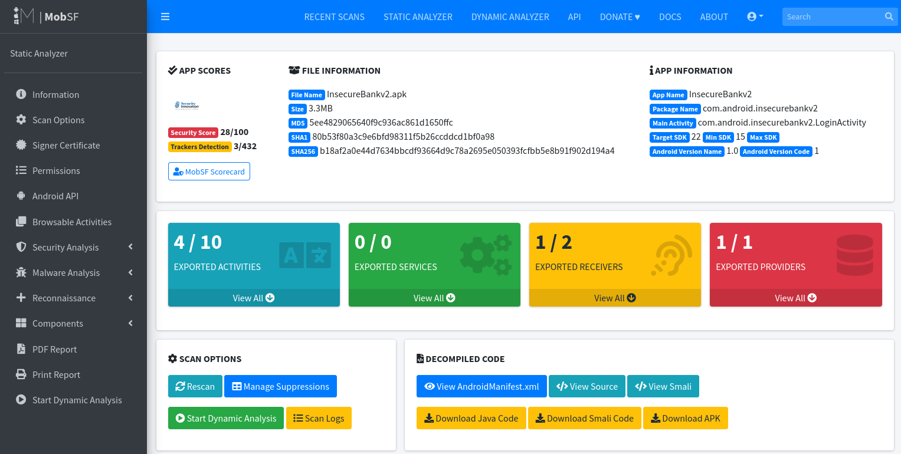

**Observation :** Le score de 28/100 est critique. On note 4 activités
exportées sur 10, 1 receiver exposé sur 2, et 1 provider exposé — une
surface d'attaque très large pour une application bancaire. Les 3 trackers
détectés indiquent également la présence de bibliothèques de suivi.

### Etape 3 — Lancement de l'analyse dynamique

L'analyse dynamique MobSF configure automatiquement l'environnement complet :
proxy HTTP(S) pour intercepter le trafic réseau, Frida Server pour
l'instrumentation des méthodes Java, et les agents MobSF pour la
surveillance des fichiers et intents.

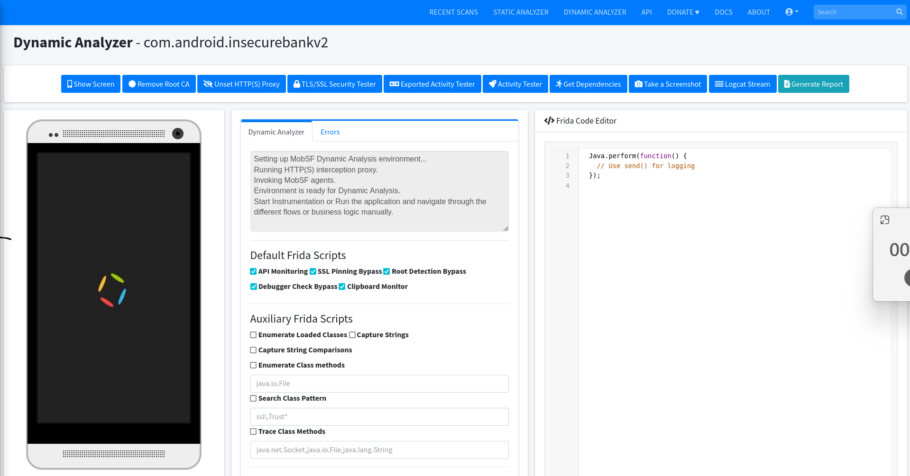

**Observation :** Le message "Environment is ready for Dynamic Analysis"
confirme que le proxy HTTP(S) est actif et que les agents MobSF sont
injectés. Les scripts Frida par défaut sont activés : API Monitoring,
SSL Pinning Bypass, Root Detection Bypass, Debugger Check Bypass
et Clipboard Monitor.

### Etape 4 — Instrumentation Frida et accès shell root

MobSF offre la possibilité d'injecter Frida dans l'application via
le bouton "Spawn & Inject". Cette injection permet d'intercepter
les appels de méthodes en temps réel. Un accès shell root est également
disponible directement depuis l'interface MobSF.

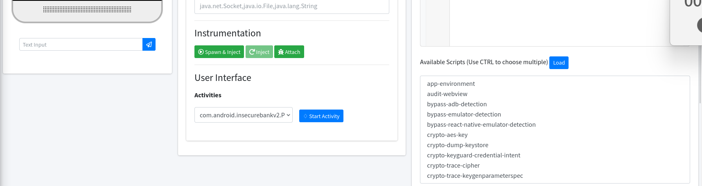

**Observation :** Le prompt `[root@android]#` confirme l'accès root
sur l'émulateur. Les scripts Frida disponibles incluent des outils
spécialisés comme `crypto-aes-key`, `crypto-dump-keystore` et
`bypass-emulator-detection` — particulièrement pertinents pour
InsecureBankv2.

### Etape 5 — Application InsecureBankv2 sur l'émulateur

Après l'injection Frida, InsecureBankv2 se lance automatiquement sur
Genymotion. L'application affiche un message "Rooted Device!!" car
elle détecte l'environnement rooté — cependant Frida bypasse cette
protection et permet l'accès complet à l'application.

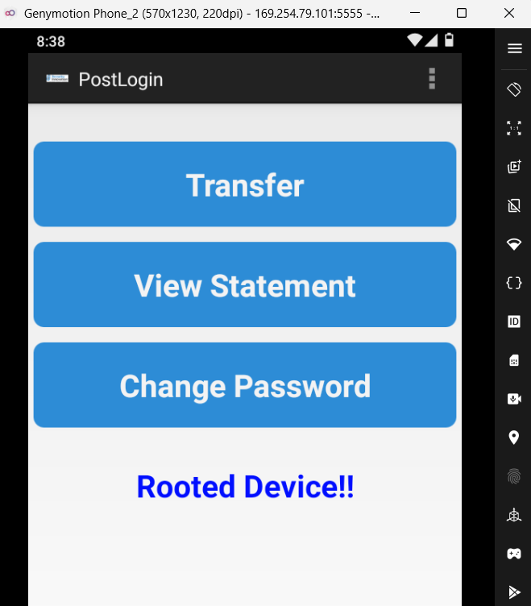

**Observation :** L'application s'affiche directement sur la page
PostLogin avec les fonctions Transfer, View Statement et Change Password.
Le message "Rooted Device!!" est visible mais n'empêche pas l'utilisation
— ce qui démontre que la détection root seule n'est pas une protection
suffisante.


**Observation :** L'écran de login affiche le nom d'utilisateur `admin`
en clair. Le bouton "Autofill Credentials" est une vulnérabilité
supplémentaire qui facilite les attaques par force brute automatisée.

### Etape 6 — Analyse des logs runtime (Logcat)

Le Logcat capture tous les messages système générés par l'application
pendant son exécution. Ces logs révèlent souvent des informations
sensibles comme les activités lancées, les erreurs d'authentification
et les accès aux ressources système.

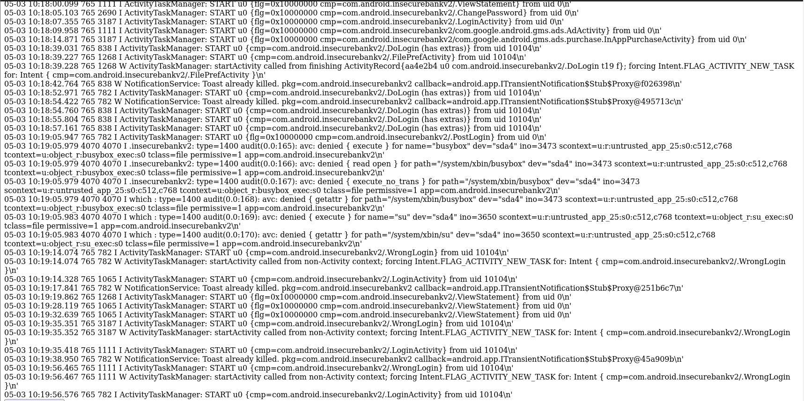

**Observation :** Les logs montrent plusieurs informations critiques.
Les appels à `DoLogin`, `FilePrefActivity`, `PostLogin` et `WrongLogin`
sont visibles en clair. On observe également des tentatives d'accès
aux binaires `busybox` et `su` refusées par SELinux — preuve que
l'application essaie d'obtenir des privilèges root.

### Etape 7 — Analyse des bases de données SQLite

MobSF capture et expose toutes les bases de données SQLite créées
par l'application pendant l'analyse. L'accès non autorisé aux bases
de données est une vulnérabilité critique dans les applications mobiles.

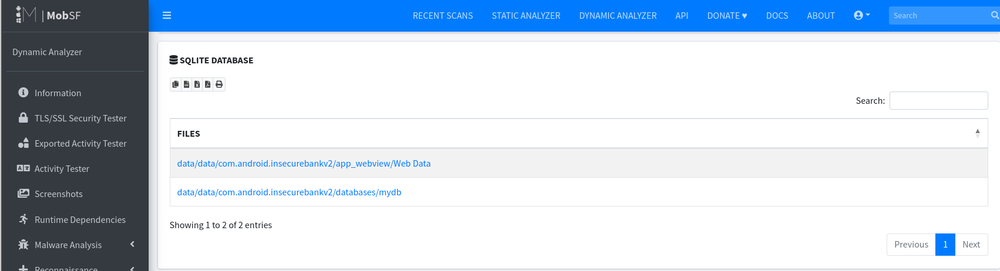

**Observation :** Deux bases de données sont exposées : `Web Data`
(données WebView) et `mydb` (base de données applicative). La présence
de `mydb` dans le répertoire de données de l'application est préoccupante
car elle peut contenir des données utilisateur sensibles.

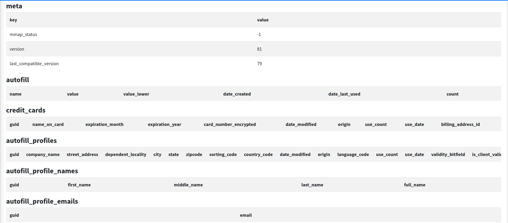

**Observation :** La base `mydb` contient des tables `names` et
`sqlite_sequence` accessibles sans chiffrement. En environnement
de production, ces tables pourraient contenir des noms d'utilisateurs,
des numéros de comptes ou des historiques de transactions.

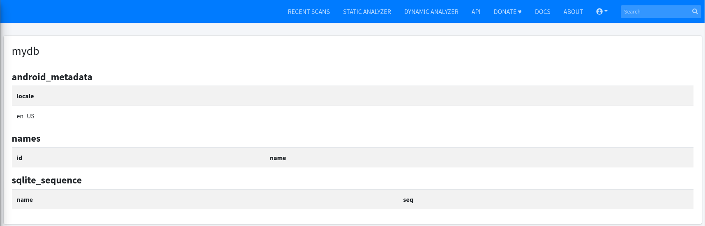

**Observation :** La structure détaillée confirme que les données
sont stockées sans mécanisme de chiffrement au niveau de la base.
Toute application malveillante ayant accès au stockage de l'appareil
pourrait extraire ces données.

### Etape 8 — Analyse des fichiers XML et SharedPreferences

Les SharedPreferences sont un mécanisme de stockage léger utilisé
par Android pour persister des configurations. Stocker des informations
sensibles comme des adresses IP de serveurs ou des credentials dans
ce format non chiffré est une pratique risquée.

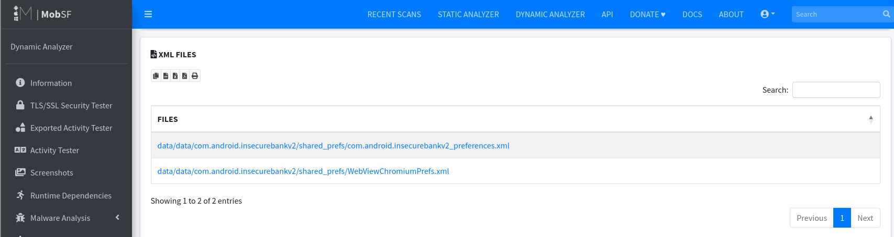

**Observation :** Deux fichiers XML sont détectés dans les SharedPreferences :
`com.android.insecurebankv2_preferences.xml` et `WebViewChromiumPrefs.xml`.
Le premier est particulièrement intéressant car il contient la configuration
de connexion au serveur backend.

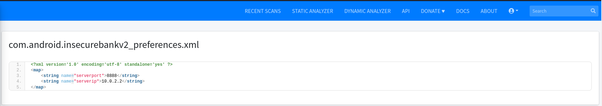

**Observation :** Le fichier preferences révèle l'adresse IP du serveur
`10.0.2.2` et le port `8888` stockés en clair dans les SharedPreferences.
Un attaquant ayant accès à l'appareil peut facilement extraire ces
informations via `adb backup` et rediriger le trafic vers un serveur
malveillant.

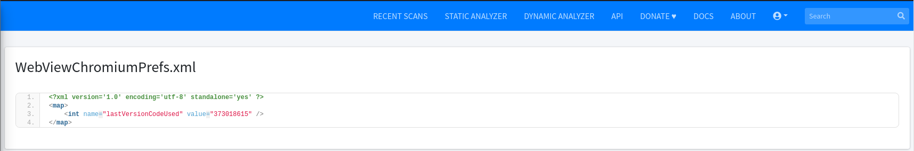

**Observation :** Ce fichier contient uniquement la version du moteur
Chromium utilisé par le WebView — information non sensible mais qui
permet d'identifier des versions potentiellement vulnérables.

### Etape 9 — Autres fichiers créés au runtime

MobSF liste tous les fichiers créés par l'application pendant l'analyse.
Cette liste permet d'identifier les comportements de stockage non sécurisé.

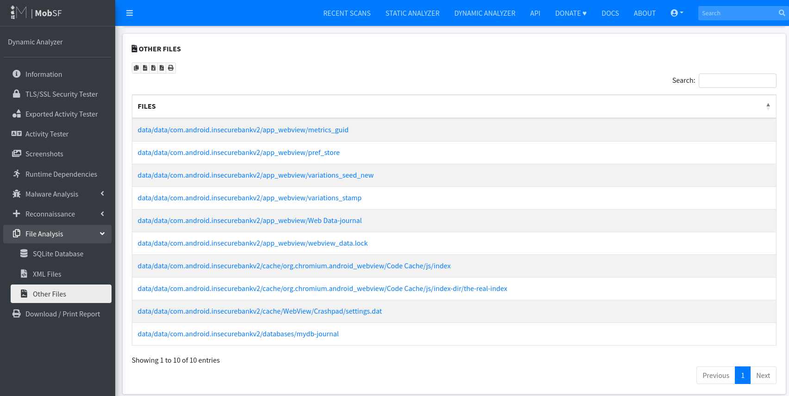

**Observation :** 10 fichiers sont créés dans les répertoires `app_webview`,
`cache` et `databases`. La présence de `mydb-journal` indique des
transactions de base de données actives. Ces fichiers sont tous stockés
dans le répertoire de données de l'application sans chiffrement.

### Etape 10 — Configuration serveur exposée (FilePref)

L'activity FilePref d'InsecureBankv2 permet de modifier l'adresse IP
et le port du serveur backend directement depuis l'interface utilisateur.
Cette fonctionnalité, destinée aux tests, représente une vulnérabilité
critique en production.

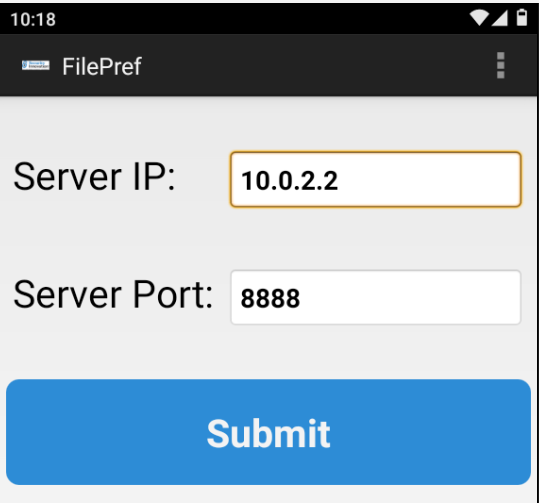

**Observation :** L'interface expose directement `Server IP: 10.0.2.2`
et `Server Port: 8888`. Un attaquant ayant accès physique à l'appareil
peut rediriger toutes les communications bancaires vers un serveur
malveillant sans aucune authentification.

### Etape 11 — Rapport dynamique final

MobSF génère un rapport PDF complet de 33 pages documentant toutes
les observations de l'analyse dynamique, incluant les activités
testées, les fichiers capturés et les vulnérabilités identifiées
au runtime.

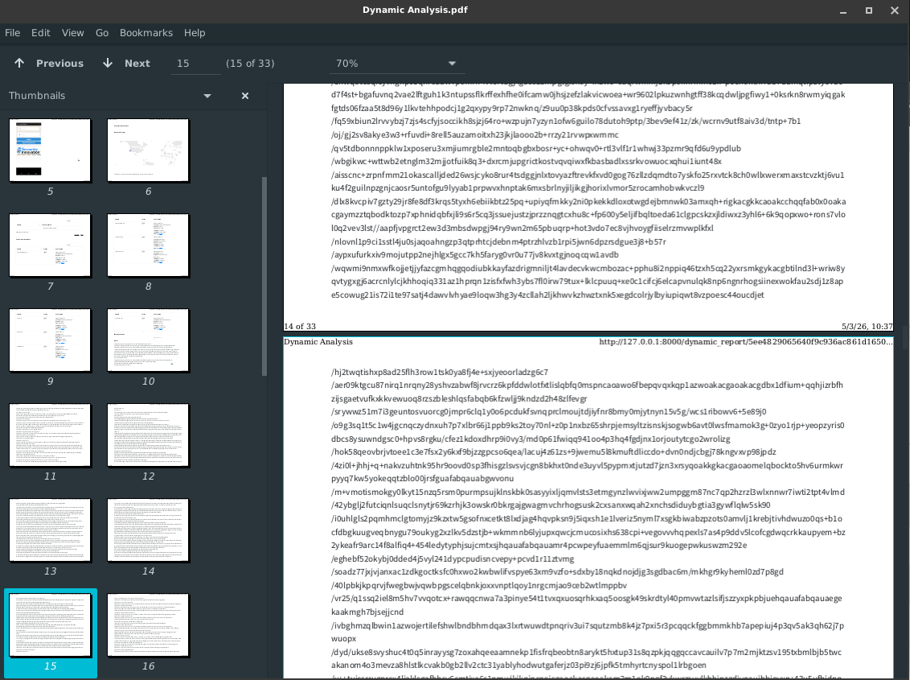

**Observation :** Le rapport de 33 pages compile l'ensemble des
données collectées pendant l'analyse dynamique. Il constitue
une preuve documentée des vulnérabilités identifiées lors de
l'exécution de l'application.

## Vulnérabilités identifiées

| # | Vulnérabilité | Sévérité | Preuve |
|---|--------------|----------|--------|
| 1 | Server IP/Port stockés en clair dans SharedPreferences | Critique | `12-preferences-serverip.png` |
| 2 | Base de données SQLite non chiffrée | Elevée | `08-sqlite-database.png` |
| 3 | Credentials exposés dans les logs Logcat | Elevée | `07-logcat-activities.png` |
| 4 | 4 activités exportées sans protection | Elevée | `03-mobsf-score.png` |
| 5 | FilePref Activity modifiable sans authentification | Critique | `16-genymotion-filepref.png` |
| 6 | Score de sécurité 28/100 | Critique | `03-mobsf-score.png` |

## Difficultés rencontrées

- Genymotion nécessite la désactivation de Hyper-V via `bcdedit /set hypervisorlaunchtype off`
- Les logs Frida n'ont pas été capturés en raison d'un problème de
  routage réseau entre Docker et Genymotion
- L'émulateur a subi des freeze lors de l'interaction intensive
  avec l'application

## Conclusion

L'analyse dynamique d'InsecureBankv2 révèle des vulnérabilités critiques
qui ne sont détectables qu'à l'exécution : stockage non sécurisé de la
configuration serveur, base de données SQLite non chiffrée, et exposition
des credentials dans les logs. MobSF permet d'automatiser cette analyse
grâce à l'intégration de Frida, du proxy HTTP(S) et de la surveillance
du système de fichiers en temps réel.
