# Lab 09 — Analyse de la Surface d'Attaque Android avec Drozer

**Cours :** Sécurité des Applications Mobiles  
**Application analysée :** InsecureBankv2  
**Package :** `com.android.insecurebankv2`  
**Environnement :** Mobexler VM + Genymotion Android 10  
**Outil :** Drozer 3.1.0  
**Date :** 3 mai 2026  
**Auditrice :** Chagdaly Hiba  

---

## Résumé exécutif

Cette analyse a porté sur l'examen de la surface d'attaque de l'application InsecureBankv2 à l'aide de l'outil Drozer. L'audit a permis d'identifier cinq activités exportées sans protection, un content provider vulnérable à l'injection SQL, un broadcast receiver exposé et quatorze permissions déclarées dont plusieurs présentent un risque élevé. Ces vulnérabilités permettraient à une application malveillante d'accéder aux fonctionnalités sensibles de l'application sans authentification préalable.

---

## 1. Mise en place de l'environnement d'audit

L'audit a débuté par l'installation et la configuration de l'outil Drozer dans l'environnement Mobexler. Drozer est un framework d'analyse de sécurité Android qui permet d'interagir avec les composants d'une application depuis l'extérieur, simulant ainsi le comportement d'une application malveillante installée sur le même appareil.

L'agent Drozer, composant côté Android indispensable à la communication avec la console d'analyse, a été installé sur l'émulateur Genymotion via la commande `adb install`. Cette étape établit le point d'entrée nécessaire à toutes les analyses ultérieures.

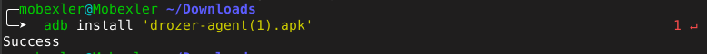

Une fois l'agent installé, la redirection du port 31415 a été configurée via ADB, permettant à la console Drozer tournant sur Mobexler de communiquer avec l'agent Android. Cette étape est fondamentale car elle établit le canal de communication entre les deux composants.

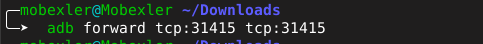

L'agent a ensuite été activé manuellement dans l'interface de l'application sur l'émulateur. Le serveur embarqué s'est mis en écoute sur le port 31415, confirmant que l'environnement est prêt à recevoir les commandes de la console d'analyse.

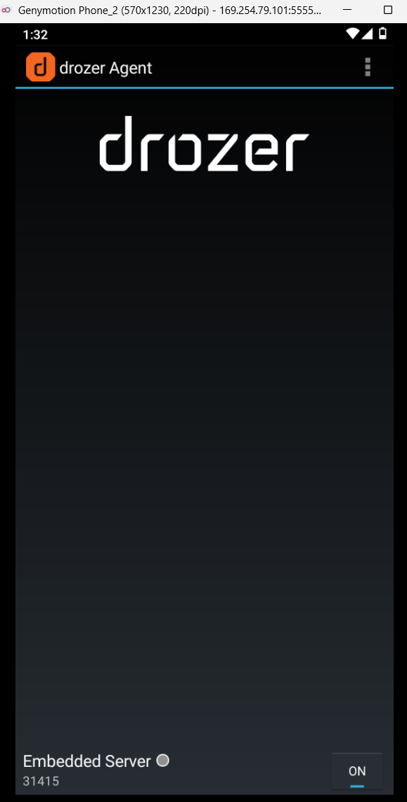

La console Drozer a alors pu établir une connexion avec l'agent, confirmée par l'affichage du prompt `dz>`. La version 3.1.0 de Drozer est opérationnelle et l'émulateur Genymobile Phone 10 est correctement sélectionné comme cible d'analyse.

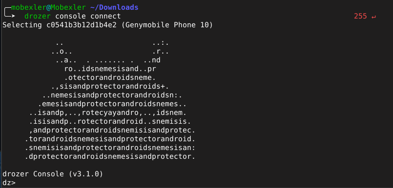

---

## 2. Identification de l'application cible

La première commande exécutée dans la console Drozer a permis de localiser l'application InsecureBankv2 parmi l'ensemble des packages installés sur l'émulateur. Le package `com.android.insecurebankv2` est confirmé présent et accessible pour l'analyse.

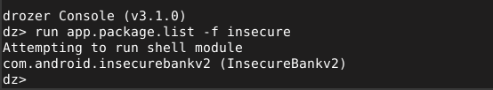

L'examen détaillé du package révèle une application ciblant Android API 22 (Android 5.1), une version ancienne présentant de nombreuses vulnérabilités connues. Plus préoccupant encore, l'application déclare quatorze permissions dont plusieurs sont particulièrement sensibles : `SEND_SMS`, `USE_CREDENTIALS`, `READ_CONTACTS`, `READ_CALL_LOG` et `ACCESS_COARSE_LOCATION`. Cette liste est excessive au regard de la fonctionnalité principale de l'application, qui est simplement une application bancaire.

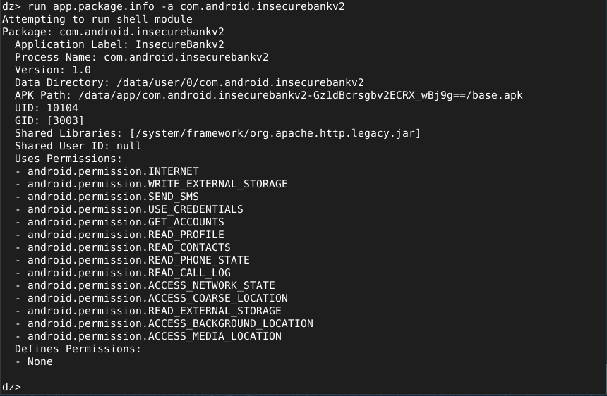

---

## 3. Cartographie des composants exposés

### Activités exportées

L'analyse des activités Android de l'application révèle cinq composants exportés, tous dépourvus de toute protection par permission. Cette configuration permet à n'importe quelle application installée sur le même appareil de lancer directement ces activités, contournant ainsi les mécanismes d'authentification normaux. Parmi ces activités figurent `LoginActivity`, `PostLogin`, `DoTransfer`, `ViewStatement` et `ChangePassword` — soit l'intégralité des fonctionnalités sensibles de l'application.

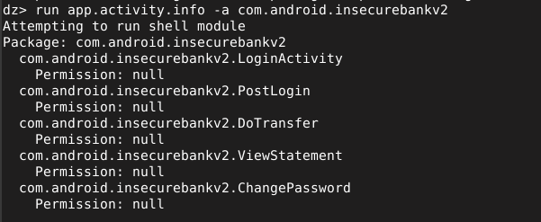

### Content Provider

L'examen du content provider `TrackUserContentProvider` révèle une absence totale de contrôle d'accès. Les permissions de lecture et d'écriture sont toutes deux définies à `null`, ce qui signifie que n'importe quelle application peut lire et modifier les données stockées dans ce provider sans nécessiter d'autorisation particulière.

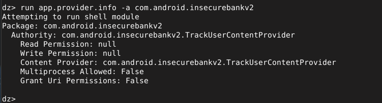

### Broadcast Receiver

Le composant `MyBroadCastReceiver` est exporté sans permission, exposant l'application à des déclenchements non autorisés. Une application malveillante pourrait envoyer des intents ciblés vers ce receiver pour déclencher des actions bancaires sensibles.

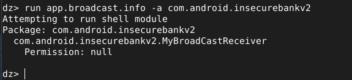

---

## 4. Analyse approfondie du content provider

Le scanner de Drozer a identifié deux URIs du content provider répondant aux requêtes sans authentification : `/trackerusers` et `/trackerusers/`. Ces endpoints exposent directement les données des utilisateurs tracés par l'application.

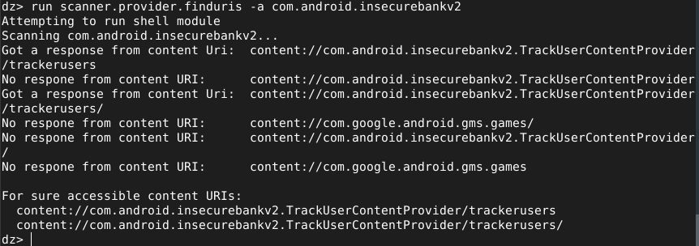

Une requête directe sur l'URI `/trackerusers/` a retourné une table contenant les colonnes `id` et `name`, confirmant que des données utilisateur sont stockées et accessibles sans aucun contrôle d'accès.

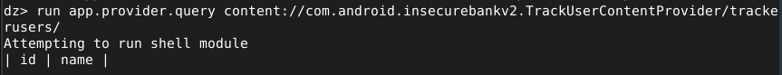

L'analyse du scanner d'injection a révélé que le content provider est vulnérable à l'injection SQL, aussi bien dans la projection que dans la sélection des requêtes. Cette vulnérabilité critique permettrait à un attaquant de manipuler les requêtes SQL sous-jacentes pour extraire, modifier ou supprimer des données arbitraires.

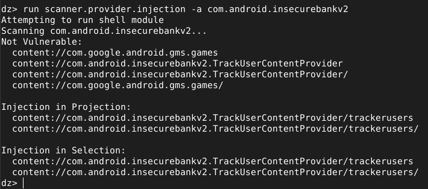

---

## 5. Analyse du manifeste Android

L'examen complet du manifeste Android confirme l'ensemble des observations précédentes. L'application cible `minSdkVersion=15`, une version d'Android datant de 2011, exposant les utilisateurs à des centaines de vulnérabilités système connues et non corrigées.

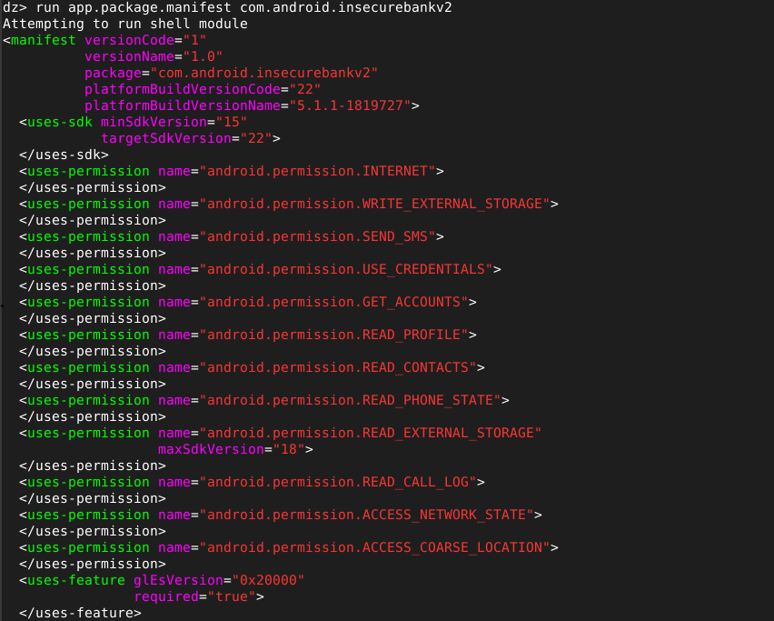

---

## 6. Tableau de triage des vulnérabilités

| ID | Vulnérabilité | Sévérité | MASVS | Remédiation |
|----|--------------|----------|-------|-------------|
| V1 | 5 activités exportées sans permission | 🔴 Élevée | MSTG-PLATFORM-1 | Ajouter `exported=false` ou permission dédiée |
| V2 | Content Provider sans contrôle d'accès | 🔴 Critique | MSTG-STORAGE-2 | Définir des permissions de lecture/écriture |
| V3 | Injection SQL dans le Provider | 🔴 Critique | MSTG-PLATFORM-2 | Utiliser des requêtes paramétrées |
| V4 | Broadcast Receiver exposé | 🟠 Moyenne | MSTG-PLATFORM-3 | Valider les intents reçus |
| V5 | Permissions excessives | 🟠 Moyenne | MSTG-AUTH-1 | Appliquer le principe du moindre privilège |
| V6 | minSdkVersion=15 obsolète | 🟠 Moyenne | MSTG-CODE-2 | Cibler minSdkVersion ≥ 28 |

---

## 7. Recommandations

L'analyse conduite avec Drozer révèle une application présentant de graves lacunes de sécurité à plusieurs niveaux. La priorité absolue est de corriger les vulnérabilités critiques liées au content provider : l'ajout de permissions de lecture et d'écriture ainsi que l'utilisation de requêtes paramétrées pour éliminer le risque d'injection SQL doivent être traités en premier lieu.

La sécurisation des activités exportées constitue le second axe prioritaire. Chaque activité sensible doit être protégée par l'attribut `exported=false` ou, lorsque l'exposition est intentionnelle, par une permission personnalisée de niveau `signature`.

Plus globalement, l'application doit être repensée selon le principe du moindre privilège : les permissions déclarées doivent être réduites au strict nécessaire, la version minimale d'Android supportée doit être relevée à API 28 au minimum, et l'ensemble des composants Android doit faire l'objet d'une revue systématique de leur exposition.
