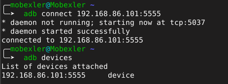
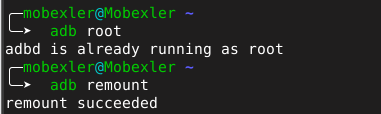
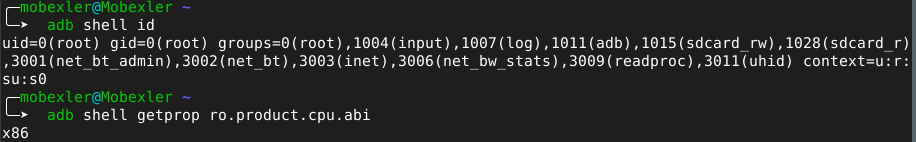
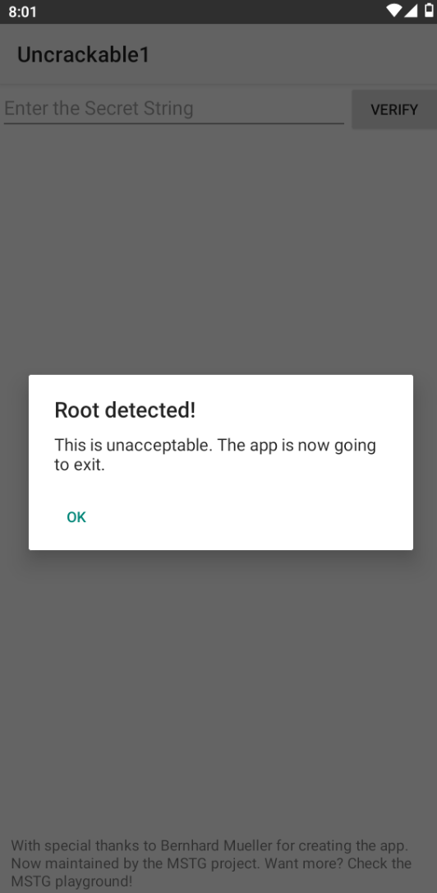
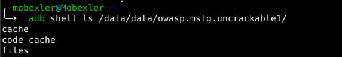
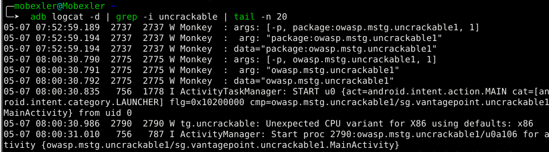
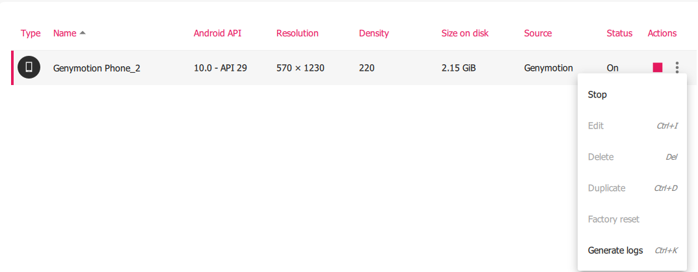

# Lab 02 — Rooting Android

## Overview

This lab explores the concept of rooting on Android, its security implications,
and the methodology for documenting a controlled rooting exercise in a laboratory environment.
All tests were performed on an isolated Genymotion emulator (Android 10 — API 29)
using Mobexler as the working environment.

---

## Environment

| Parameter        | Value                        |
|------------------|------------------------------|
| Date             | 2026-05-07                   |
| Author           | Chagdaly Hiba                |
| Device           | Genymotion Phone_2           |
| Android Version  | 10.0 — API 29                |
| Architecture     | x86                          |
| Application      | OWASP UnCrackable Level 1    |
| Data             | Fictitious only              |
| Network          | Isolated (test environment)  |
| Reset performed  | Yes                          |

---

## Scope

- **Application:** OWASP MSTG UnCrackable Level 1 (`owasp.mstg.uncrackable1`)
- **Device:** Genymotion emulator — dedicated to security testing
- **Objective:** Understand rooting and its impact on Android security mechanisms
- **Data:** Fictitious only
- **Network:** Test environment — isolated

---

## Step 1 — Connect to Genymotion via ADB

```bash
adb connect 192.168.86.101:5555
adb devices
```

The device must appear with status `device`.



---

## Step 2 — Enable Root Mode

```bash
adb root
adb remount
```

Expected output: `adbd is already running as root` and `remount succeeded`.



---

## Step 3 — Verify Root Privileges

```bash
adb shell id
```

Expected output: `uid=0(root)` — confirms full root access.



---

## Step 4 — Check Verified Boot State

```bash
adb shell getprop ro.boot.verifiedbootstate
adb shell getprop ro.boot.veritymode
adb shell getprop ro.boot.vbmeta.device_state
```


> **Observation:** All three properties returned empty values on Genymotion.
> This is expected — Genymotion does not implement AVB as it is a software emulator.
> On a real device, `ro.boot.verifiedbootstate` would return:
> - `green` — system intact and verified
> - `orange` — system modified, boot allowed with warning
> - `red` — integrity compromised

---

## Step 5 — Disable Verity

```bash
adb disable-verity
```


---

## Step 6 — Clean Device Home Screen

Verify the device is clean — no personal accounts, no residual applications.


---

## Step 7 — Launch Test Application

```bash
adb shell monkey -p owasp.mstg.uncrackable1 1
```

The application immediately triggered a **Root detected** alert,
confirming that the device is correctly rooted and that the application
implements a root detection mechanism.



> **Key observation:** The message "Root detected! This is unacceptable.
> The app is now going to exit." demonstrates that the application
> actively checks for root at runtime and refuses to operate in a rooted environment.

---

## Step 8 — Inspect Application Data (MASTG)

```bash
adb shell ls /data/data/owasp.mstg.uncrackable1/
```



> **Observation:** No `shared_prefs` directory found.
> The application does not store any sensitive data in clear text
> in shared preferences. Only `cache`, `code_cache`, and `files`
> directories are present.

---

## Step 9 — Analyze System Logs (MASTG)

```bash
adb logcat -d | grep -i uncrackable | tail -n 20
```



> **Observation:** Logcat confirms the application was launched from `uid 0`
> (root context). The entry `ActivityTaskManager: START u0` from `uid 0`
> confirms root-level execution.

---

## Step 10 — Factory Reset

After completing all tests, the Genymotion device was reset via
**Factory Reset** from the Genymotion device manager to ensure
no residual data or configuration persists.



---

## Concepts

### Definition of Rooting

- Root = superuser privileges on the Android system
- Rooting modifies the trust model and security protections of the OS
- Useful in a laboratory context to observe system-level behaviors
- Requires strict isolation, traceability, and environment reset

### Chain of Trust

```
ROM --> Bootloader --> Signature verification --> Boot --> System verification --> Android
```

Each component verifies the authenticity of the next before granting execution.
If any component is modified, the chain is broken and the system reports
a compromised state (`orange` or `red`).

### Android Verified Boot (AVB 2.0)

- Adds modern integrity verification per partition
- Includes rollback protection against older vulnerable versions
- More modular and flexible than Verified Boot 1.0

---

## Test Scenarios

| # | Scenario | Result |
|---|----------|--------|
| 1 | Launch the application | App started via ADB monkey |
| 2 | Observe root detection | "Root detected" alert displayed immediately |
| 3 | Inspect application data | No shared_prefs — no data stored in clear text |

---

## Risk Matrix

| # | Risk |
|---|------|
| 1 | Integrity not guaranteed — conclusions may be biased |
| 2 | Increased attack surface if device leaves the lab |
| 3 | Sensitive data exposed if present on device |
| 4 | System instability — tests may not be reproducible |
| 5 | Mixing personal and test accounts — potential data leak |
| 6 | Poor end-of-session cleanup — sensitive data may persist |
| 7 | Non-isolated network — unintended effects on external systems |
| 8 | Insufficient traceability — impossible to audit or reproduce |

---

## Defensive Measures

| # | Measure |
|---|---------|
| 1 | Isolated network — no uncontrolled communication |
| 2 | Fictitious data only — no real data risk |
| 3 | Dedicated emulator for security testing only |
| 4 | Factory reset at end of session |
| 5 | Detailed configuration log for reproducibility |
| 6 | No personal accounts used |
| 7 | Strict control of installed APKs |
| 8 | Timestamped screenshots at each step |

---

## OWASP MASVS — Relevant Requirements

| Requirement | Description |
|-------------|-------------|
| STORAGE-1 | Sensitive data must be stored using appropriate encryption mechanisms |
| NETWORK-1 | Network communications must use TLS with correct configuration and certificate verification |

---

## OWASP MASTG — Tests Applied

| Test | Command | Observation |
|------|---------|-------------|
| Check shared preferences | `adb shell ls /data/data/[pkg]/shared_prefs/` | No shared_prefs found |
| Analyze logs for leaks | `adb logcat -d \| grep -i uncrackable` | Launch confirmed from uid 0 |

---

## Final Checklist

### Before Testing
- [x] Scope defined
- [x] Clean Genymotion device
- [x] Test application available
- [x] 3 scenarios documented
- [x] Android and app versions recorded

### After Testing
- [x] Test data removed
- [x] Factory reset performed
- [x] Reset evidence captured
- [x] Report and traceability saved
- [x] No personal accounts used

---

## Legal Notice

All tests were performed in an isolated, authorized laboratory environment
for educational purposes only.
Rooting a personal device may void the manufacturer warranty,
expose personal data, and in some jurisdictions may violate
terms of service or applicable regulations.
