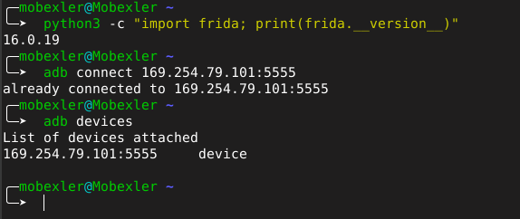
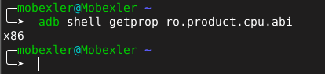
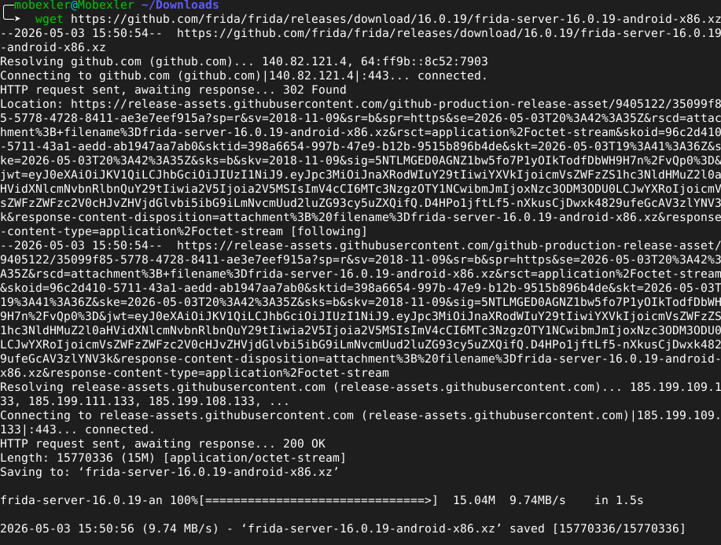
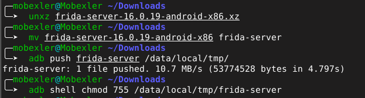
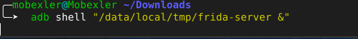
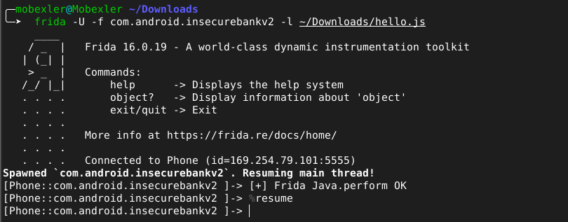
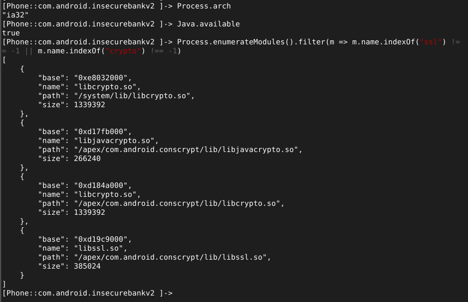
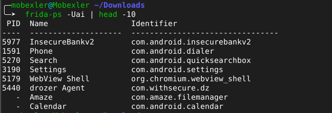

# Lab 10 — Installation et configuration de Frida

**Cours :** Sécurité des Applications Mobiles  
**Application analysée :** InsecureBankv2  
**Package :** `com.android.insecurebankv2`  
**Environnement :** Mobexler VM + Genymotion Android 10  
**Outil :** Frida 16.0.19  
**Date :** 3 mai 2026  
**Auditrice :** Chagdaly Hiba  

---

## Résumé exécutif

Ce lab a permis de mettre en place un environnement complet d'instrumentation dynamique avec Frida. L'installation du client Frida sur Mobexler, le déploiement de frida-server sur l'émulateur Genymotion et la validation de l'injection de scripts JavaScript dans un processus Android ont été réalisés avec succès. L'environnement est désormais prêt pour des analyses dynamiques avancées.

---

## 1. Vérification de l'environnement

La première étape a consisté à vérifier que Frida était correctement installé sur Mobexler et que l'émulateur Genymotion était accessible via ADB. La version 16.0.19 de Frida est confirmée opérationnelle, et l'émulateur répond sur l'adresse `169.254.79.101:5555`.



L'architecture CPU de l'émulateur a ensuite été identifiée afin de télécharger la version compatible de frida-server. L'émulateur Genymotion utilise une architecture **x86**, information indispensable pour choisir le bon binaire serveur.



---

## 2. Déploiement de frida-server

Le binaire frida-server correspondant à la version 16.0.19 et à l'architecture x86 a été téléchargé depuis les releases officielles du projet Frida sur GitHub. Le fichier de 15 MB a été récupéré directement dans le dossier de travail.



Une fois téléchargé, le fichier compressé a été extrait, renommé et poussé vers l'émulateur via ADB dans le répertoire `/data/local/tmp/`. Les permissions d'exécution ont ensuite été attribuées au binaire avec `chmod 755`.



frida-server a été lancé en arrière-plan sur l'émulateur. La vérification via `adb shell ps | grep frida` confirme que le processus est actif avec le PID 69904, en attente de connexions entrantes.



---

## 3. Validation de la connexion

La commande `frida-ps -Uai` a permis de lister l'ensemble des applications installées sur l'émulateur. InsecureBankv2, drozer Agent et plusieurs applications système sont visibles, confirmant que la communication entre Frida et l'émulateur est pleinement opérationnelle.


---

## 4. Injection d'un script de validation

Un script minimal `hello.js` a été créé pour valider la capacité de Frida à injecter du code JavaScript dans le processus cible. Ce script utilise `Java.perform()` pour s'exécuter dans le contexte de la machine virtuelle Java de l'application.

```javascript
Java.perform(function () {
  console.log("[+] Frida Java.perform OK");
});
```

L'injection dans InsecureBankv2 a produit le message attendu `[+] Frida Java.perform OK`, confirmant que Frida peut instrumenter le processus et interagir avec son environnement Java.



---

## 5. Exploration de la console interactive

Depuis la console Frida, plusieurs commandes d'inspection ont été exécutées. L'architecture du processus est confirmée en **ia32**, le runtime Java est disponible (`Java.available = true`), et trois bibliothèques liées à la cryptographie ont été identifiées : `libcrypto.so`, `libjavacrypto.so` et `libssl.so`. La présence de ces bibliothèques indique qu'InsecureBankv2 utilise des mécanismes cryptographiques natifs pour ses communications.



Une dernière vérification avec `frida-ps -Uai` confirme que l'environnement reste stable après l'injection, avec InsecureBankv2 toujours en cours d'exécution aux côtés des autres applications système.



---

## 6. Bilan de l'installation

| Composant | Version | Status |
|-----------|---------|--------|
| Frida client | 16.0.19 | ✅ Opérationnel |
| frida-server android-x86 | 16.0.19 | ✅ Déployé |
| Connexion ADB | 169.254.79.101:5555 | ✅ Active |
| Injection Java.perform | hello.js | ✅ Validée |
| Bibliothèques crypto détectées | libcrypto, libssl | ✅ Identifiées |

---

## Structure du dépôt

```
06-frida-hooking/lab10-frida-setup/
├── README.md
├── rapport_lab10.pdf
├── rapport_lab10.tex
├── hello.js
└── screenshots/
    ├── 01-frida-version.png
    ├── 02-cpu-arch.png
    ├── 03-frida-server-download.png
    ├── 04-frida-server-deploy.png
    ├── 05-frida-server-running.png
    ├── 06-frida-ps.png
    ├── 07-frida-inject.png
    ├── 08-frida-console.png
    └── 09-frida-ps-final.png
```
