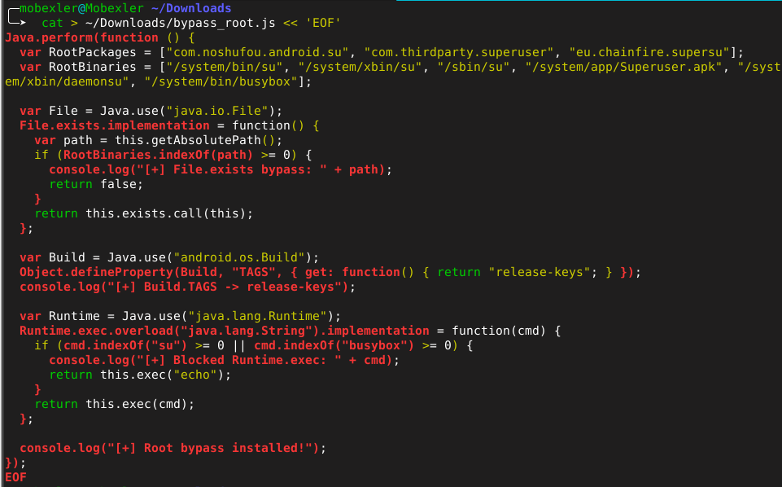
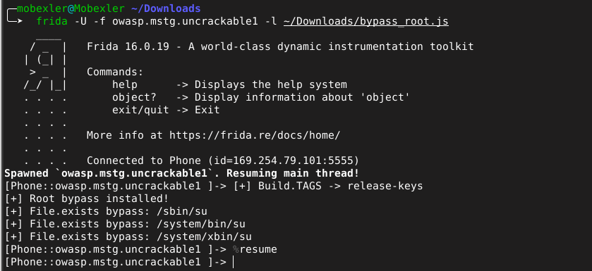
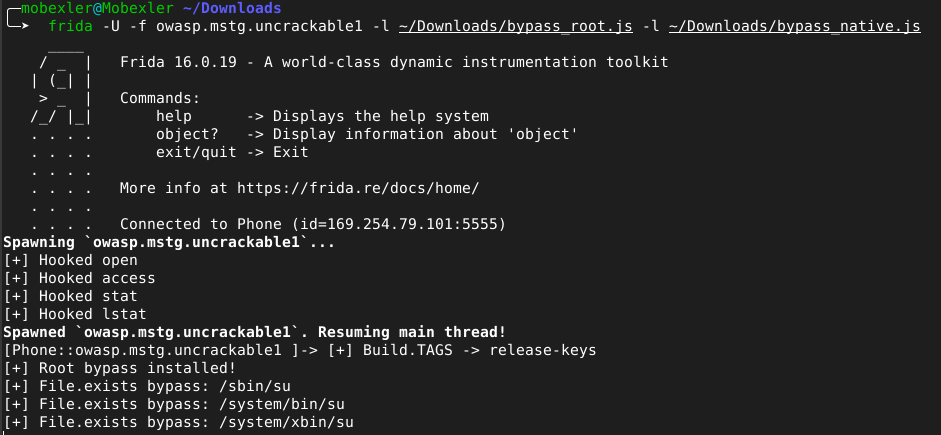
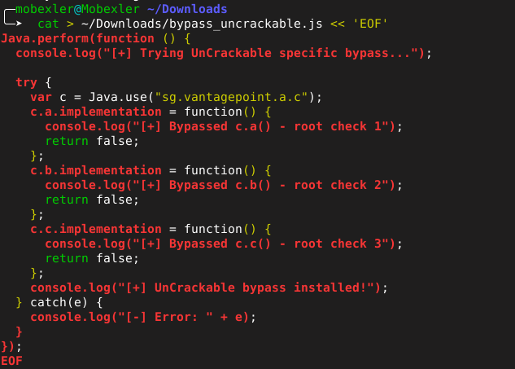
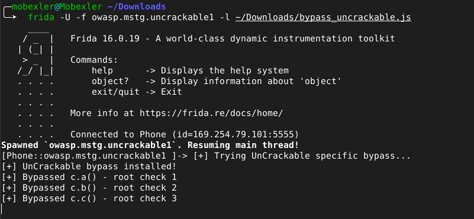

# Lab 11 — Bypass de la Détection de Root Android avec Frida

**Cours :** Sécurité des Applications Mobiles  
**Application analysée :** OWASP UnCrackable Level 1  
**Package :** `owasp.mstg.uncrackable1`  
**Environnement :** Mobexler VM + Genymotion Android 10  
**Outil :** Frida 16.0.19  
**Date :** 3 mai 2026  
**Auditrice :** Chagdaly Hiba  

---

## Résumé exécutif

Ce lab a porté sur le contournement des mécanismes de détection de root implémentés dans l'application OWASP UnCrackable Level 1. En combinant des hooks Java et natifs via Frida, les trois couches de protection de l'application ont été neutralisées avec succès, permettant à l'application de s'exécuter normalement sur un émulateur rooté sans déclencher d'alerte.

---

## 1. Comportement initial de l'application

Sans instrumentation, l'application UnCrackable Level 1 détecte immédiatement l'environnement rooté de l'émulateur Genymotion et affiche une alerte bloquante "Root detected! This is unacceptable. The app is now going to exit." L'application se ferme dès que l'utilisateur appuie sur OK, rendant toute interaction impossible.

---

## 2. Analyse des mécanismes de détection

Grâce à l'analyse statique réalisée dans le Lab 04, on sait qu'UnCrackable Level 1 implémente sa détection root dans la classe `sg.vantagepoint.a.c` avec trois méthodes distinctes. La méthode `c.a()` vérifie les tags de build, `c.b()` recherche des binaires suspects comme `su` et `busybox`, et `c.c()` vérifie les chemins système caractéristiques d'un appareil rooté. Cette connaissance du code source décompilé nous permet de cibler précisément les hooks nécessaires.

---

## 3. Préparation du script de bypass Java

Le premier script de bypass a été créé pour neutraliser les vérifications Java. Il intercepte `File.exists()` pour retourner `false` sur les chemins suspects, force `Build.TAGS` à retourner `release-keys` au lieu de `test-keys`, et bloque les appels `Runtime.exec()` tentant d'exécuter `su` ou `busybox`.

L'injection du script dans UnCrackable Level 1 produit les logs attendus confirmant que les hooks Java sont actifs. Les messages `[+] Build.TAGS -> release-keys`, `[+] Root bypass installed!` et les trois occurrences de `[+] File.exists bypass` attestent que la couche Java est correctement neutralisée.

---

## 4. Ajout des hooks natifs

La détection Java seule ne suffit pas. UnCrackable Level 1 utilise également des appels natifs pour vérifier la présence de binaires suspects. Un second script `bypass_native.js` a été développé pour hooker les fonctions natives `open`, `access`, `stat` et `lstat`, interceptant tout accès aux chemins suspects au niveau du système d'exploitation.

Le lancement combiné des deux scripts confirme que les quatre fonctions natives sont correctement hookées avant même que l'application ne démarre, grâce au mode spawn de Frida.

---

## 5. Bypass ciblé de la classe de détection

Pour contourner définitivement la détection, un troisième script `bypass_uncrackable.js` a été développé en s'appuyant sur la connaissance du code source obtenue lors du Lab 04. Ce script cible directement les méthodes `c.a()`, `c.b()` et `c.c()` de la classe `sg.vantagepoint.a.c` et les force à retourner `false`.

L'injection produit les trois messages de confirmation `[+] Bypassed c.a()`, `[+] Bypassed c.b()` et `[+] Bypassed c.c()`, attestant que les trois vérifications de root sont neutralisées simultanément.

---

## 6. Résultat final — Application déverrouillée

Après l'injection du bypass ciblé, l'application UnCrackable Level 1 s'ouvre normalement sur l'émulateur rooté, sans aucune alerte. Le champ "Enter the Secret String" est accessible et le bouton VERIFY fonctionnel, démontrant le succès complet du contournement de la détection root.

---

## 7. Scripts utilisés

| Script | Technique | Cible |
|--------|-----------|-------|
| `bypass_root.js` | Hook Java | `File.exists`, `Build.TAGS`, `Runtime.exec` |
| `bypass_native.js` | Hook natif | `open`, `access`, `stat`, `lstat` |
| `bypass_uncrackable.js` | Hook Java ciblé | `sg.vantagepoint.a.c.a/b/c` |

---

## 8. Conclusion

Ce lab démontre qu'une détection root multi-couches peut être contournée par instrumentation dynamique dès lors que le code source décompilé est connu. La combinaison d'une analyse statique préalable (Lab 04) et d'une instrumentation Frida ciblée constitue une approche méthodique et efficace pour neutraliser les protections d'une application Android.
