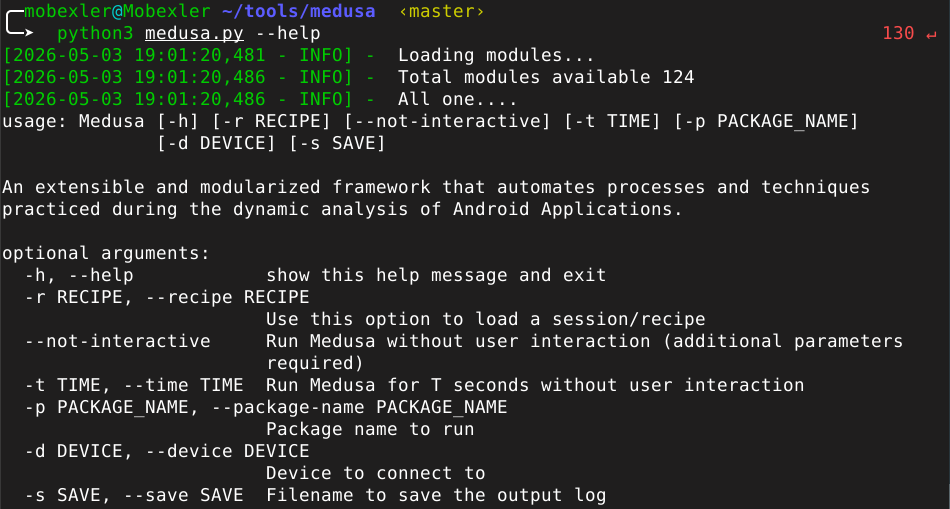
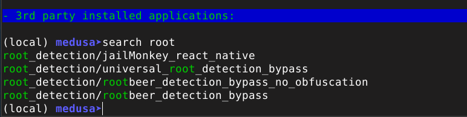
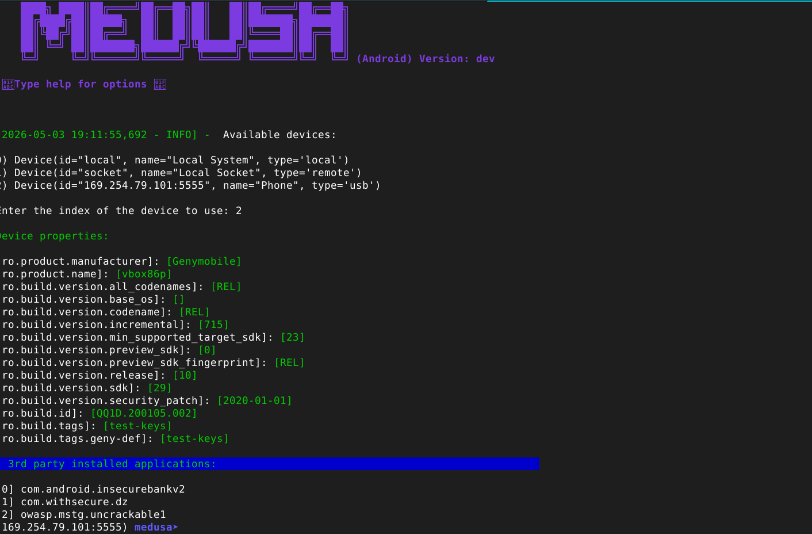
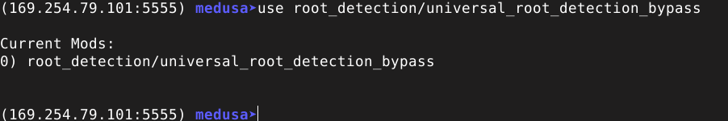
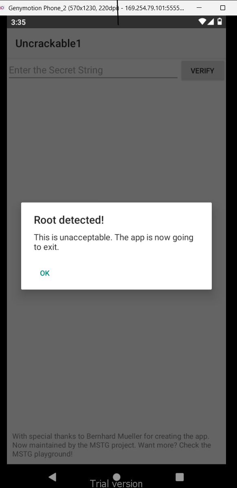
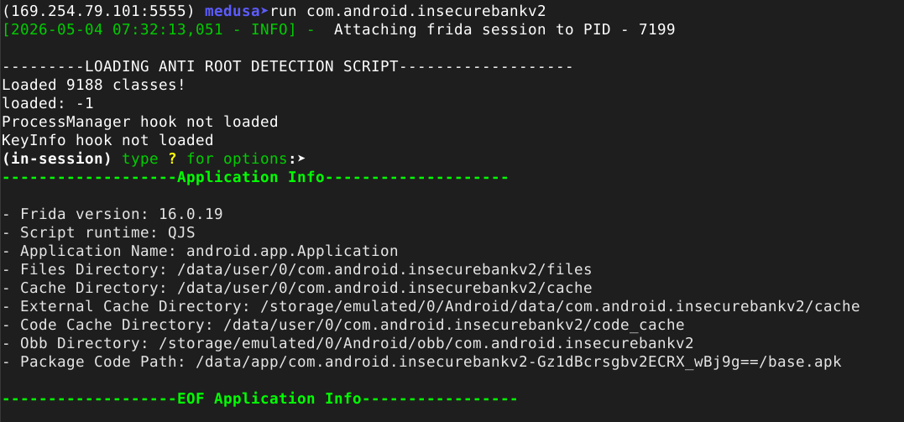
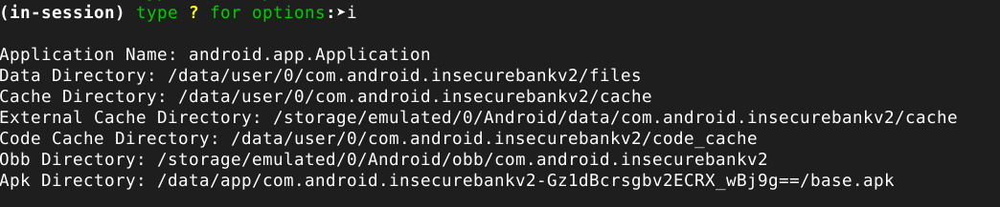
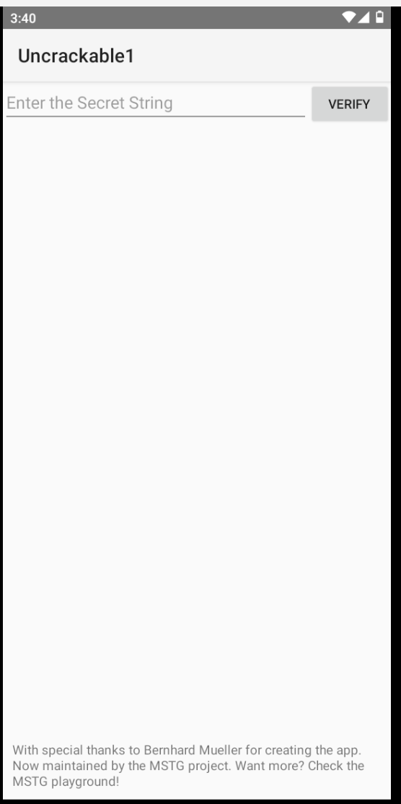

# Lab 12 — Bypass de la Détection de Root avec Medusa

## Environnement de travail

| Élément | Valeur |
|---------|--------|
| Plateforme | Mobexler (Debian Bullseye) |
| Émulateur | Genymotion — Android 10 (API 29) |
| Application cible | OWASP UnCrackable Level 1 |
| Outil principal | Medusa (Ch0pin/medusa) |
| Frida | 16.0.19 |

---

## Installation de Medusa

Medusa est un framework d'instrumentation dynamique modulaire basé sur Frida, développé pour automatiser les analyses de sécurité d'applications Android. Il dispose de 124 modules couvrant des scénarios variés allant de la détection de root au bypass SSL en passant par l'interception réseau.

L'installation a été réalisée via clonage du dépôt officiel, suivi de l'installation des dépendances Python :

```bash
git clone https://github.com/Ch0pin/medusa.git ~/tools/medusa
cd ~/tools/medusa
pip3 install -r requirements.txt
python3 medusa.py --help
```



Le framework confirme le chargement de 124 modules disponibles, ce qui atteste d'une installation complète et fonctionnelle.

---

## Exploration des modules de détection root

Avant de procéder au bypass, il convient d'identifier les modules disponibles pour contourner la détection de root. La commande `search root` dans la console Medusa révèle quatre modules dédiés à cette problématique.

```
search root
```



Parmi les modules identifiés, `root_detection/universal_root_detection_bypass` est le plus polyvalent. Il neutralise simultanément les vérifications Java courantes : lecture de `Build.TAGS`, contrôle de l'existence des binaires `su` et `busybox`, et interception des appels `Runtime.exec()`.

---

## Connexion à l'émulateur Genymotion

Medusa énumère automatiquement les appareils disponibles via Frida. L'émulateur Genymotion, connecté via ADB TCP sur l'adresse `169.254.79.101:5555`, apparaît en tant que device de type `usb` sous l'identifiant `Phone`.



Les propriétés système de l'appareil confirment un environnement rooté : `ro.build.tags` retourne `test-keys` au lieu de `release-keys`, ce qui constitue précisément l'un des indicateurs que les applications détectent pour identifier un appareil compromis.

---

## Chargement du module de bypass

Le module `root_detection/universal_root_detection_bypass` est ajouté à la session active. Medusa maintient une liste de modules courants qui seront compilés et injectés ensemble lors de l'exécution.

```
use root_detection/universal_root_detection_bypass
```



---

## Comportement sans bypass — Root détecté

Sans instrumentation, l'application UnCrackable Level 1 détecte immédiatement l'environnement rooté au démarrage et affiche une alerte bloquante. L'utilisateur ne peut pas accéder aux fonctionnalités de l'application.



Ce comportement illustre la protection mise en place par le développeur : dès que les vérifications Java identifient des indicateurs de root (`test-keys`, présence de `su`, etc.), l'application force sa fermeture.

---

## Injection du module et bypass actif

La commande `run` avec le nom du package cible déclenche l'attachement de la session Frida et l'injection du script compilé. Medusa confirme le chargement du script anti-root et fournit des informations détaillées sur l'application cible.

```
run com.android.insecurebankv2
```



Le message `LOADING ANTI ROOT DETECTION SCRIPT` confirme que le module est injecté avec succès. Medusa charge 9 188 classes de l'application et établit une session interactive permettant d'inspecter et de contrôler l'application en temps réel.

---

## Informations de session — Application inspectée

En session active, la commande `i` expose les métadonnées de l'application : répertoires de données, cache, chemins APK. Ces informations sont utiles pour orienter une analyse plus approfondie.



---

## Résultat — Application ouverte sans alerte

Avec le module de bypass actif, l'application UnCrackable Level 1 s'ouvre sans déclencher l'alerte de détection root. L'interface principale est accessible et l'utilisateur peut interagir normalement avec l'application.



Le bypass démontre que les vérifications Java de détection root peuvent être neutralisées par instrumentation dynamique sans modifier le code de l'application ni la décompiler.

---

## Bilan des captures

| # | Fichier | Contenu |
|---|---------|---------|
| 01 | `01-medusa-installed.png` | Medusa installé — 124 modules |
| 02 | `02-medusa-search-root.png` | 4 modules root bypass disponibles |
| 03 | `03-medusa-connected.png` | Connexion à Genymotion établie |
| 04 | `04-medusa-module-loaded.png` | Module universal_root_detection_bypass chargé |
| 05 | `05-medusa-run.png` | Session active — script injecté |
| 06 | `06-after-bypass.png` | Application ouverte sans alerte |
| 07 | `07-root-detected-before.png` | Comportement sans bypass |
| 08 | `08-medusa-app-info.png` | Informations de session |
