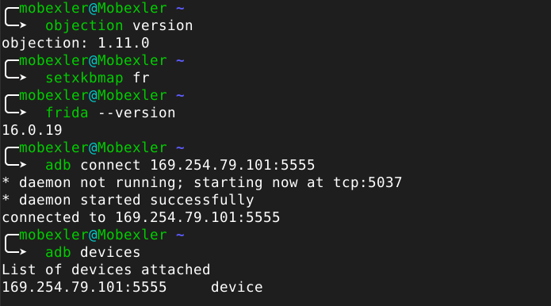
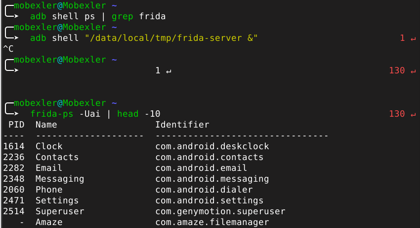
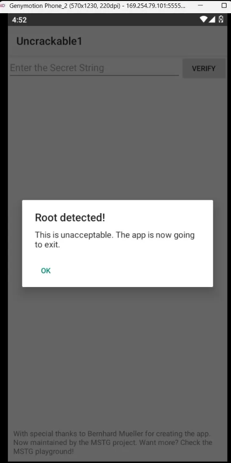
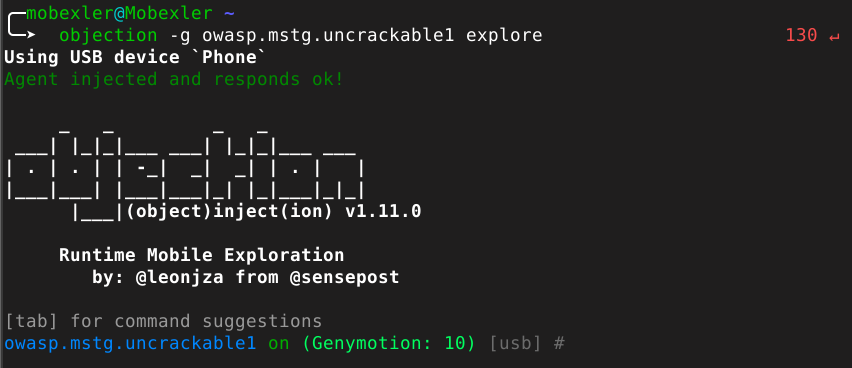
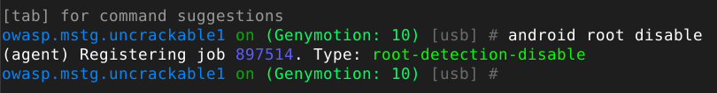
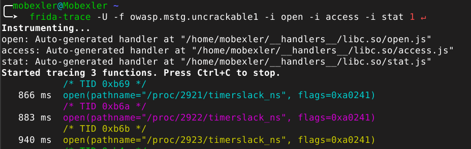

# Lab 13 — Bypass de la Détection de Root Android avec Objection

## Contexte

Les applications Android modernes intègrent des mécanismes de détection
de root pour empêcher leur exécution sur des appareils compromis. Ces
vérifications s'appuient généralement sur la lecture de propriétés
système comme `Build.TAGS`, la recherche de binaires suspects comme
`su` ou `busybox`, et l'exécution de commandes via `Runtime.exec()`.

Ce lab démontre comment neutraliser ces protections en utilisant
**Objection**, un framework d'instrumentation dynamique basé sur Frida
qui automatise le bypass via une seule commande : `android root disable`.

---

## Environnement de travail

| Élément | Valeur |
|---------|--------|
| Plateforme | Mobexler (Debian Bullseye) |
| Émulateur | Genymotion — Android 10 (API 29) |
| Architecture | x86 |
| Application cible | OWASP UnCrackable Level 1 |
| Package | `owasp.mstg.uncrackable1` |
| Outil principal | Objection v1.11.0 |
| Frida | 16.0.19 |

---

## Étape 1 — Vérification de l'environnement

La première étape consiste à vérifier que les outils sont correctement
installés et que l'émulateur est accessible via ADB. Objection v1.11.0
et Frida 16.0.19 sont confirmés côté PC, et Genymotion est reconnu
comme device actif.

```bash
objection version
frida --version
adb connect 169.254.79.101:5555
adb devices
```



---

## Étape 2 — Démarrage de frida-server

frida-server est poussé sur l'émulateur et lancé en arrière-plan.
La commande `frida-ps -Uai` confirme que l'émulateur est visible
et que les applications installées sont énumérées correctement.

```bash
adb shell "/data/local/tmp/frida-server &"
frida-ps -Uai | head -10
```



---

## Étape 3 — Comportement sans bypass

Sans instrumentation, l'application UnCrackable Level 1 détecte
immédiatement l'environnement rooté dès son lancement. Une alerte
bloquante s'affiche et l'application force sa fermeture, empêchant
tout accès à ses fonctionnalités.



---

## Étape 4 — Lancement de la console Objection

Objection s'attache au processus de l'application via Frida et ouvre
une console interactive. Le message `Agent injected and responds ok!`
confirme que l'injection a réussi et que la session est établie sur
l'émulateur Genymotion.

```bash
objection -g owasp.mstg.uncrackable1 explore
```



---

## Étape 5 — Bypass de la détection root

La commande `android root disable` installe automatiquement l'ensemble
des hooks nécessaires au bypass. Objection enregistre un job de type
`root-detection-disable` qui neutralise en arrière-plan toutes les
vérifications Java courantes sans nécessiter d'écrire un script Frida
manuellement.
android root disable

Les hooks installés couvrent :
- `android.os.Build.TAGS` → forcé à `release-keys`
- `java.io.File.exists()` → retourne `false` pour `/sbin/su`, `/system/bin/su`, `busybox`
- `Runtime.getRuntime().exec()` → bloque les appels à `su` et `which su`



---

## Étape 6 — Résultat après bypass

Avec les hooks actifs, l'application UnCrackable Level 1 s'ouvre sans
déclencher aucune alerte. L'interface principale est accessible et
l'utilisateur peut interagir normalement avec l'application, prouvant
que toutes les vérifications Java de détection root ont été neutralisées.


---

## Étape 7 — Analyse des appels natifs avec frida-trace

Pour aller plus loin, `frida-trace` permet d'observer les appels
système natifs effectués par l'application. On identifie clairement
des appels `access()` vers `/sbin/su`, `/system/sbin/su` et
`/system/bin/su` — les indicateurs de root vérifiés au niveau C/C++
que Objection seul ne neutralise pas.

```bash
frida-trace -U -f owasp.mstg.uncrackable1 \
  -i open -i access -i stat
```



---

## Bilan des captures

| # | Fichier | Contenu |
|---|---------|---------|
| 01 | `01-objection-version.png` | Objection v1.11.0 + Frida 16.0.19 |
| 02 | `02-adb-frida-ps.png` | frida-server actif + liste des apps |
| 03 | `03-root-detected-before.png` | Alerte Root detected! sans bypass |
| 04 | `04-objection-explore.png` | Console Objection ouverte |
| 05 | `05-android-root-disable.png` | Hooks root-detection-disable installés |
| 06 | `06-after-bypass.png` | Application accessible sans alerte |
| 07 | `07-frida-trace.png` | Appels natifs /sbin/su tracés |

---

## Références

- [Objection — sensepost](https://github.com/sensepost/objection)
- [Frida — Dynamic Instrumentation](https://frida.re/)
- [OWASP UnCrackable Apps](https://github.com/OWASP/owasp-mastg)
- [Android Platform Tools](https://developer.android.com/tools/releases/platform-tools)
