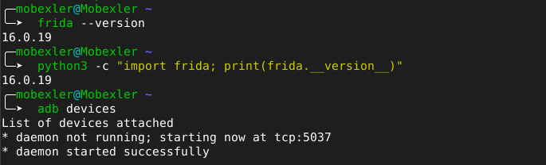
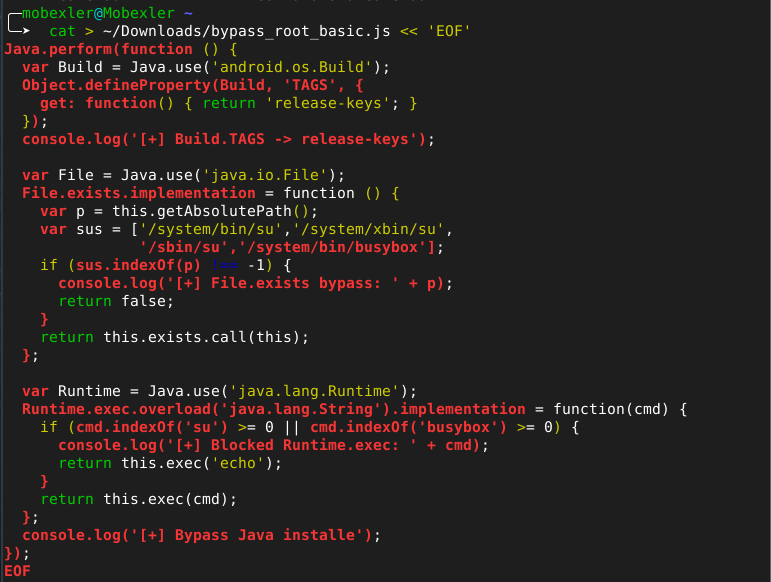
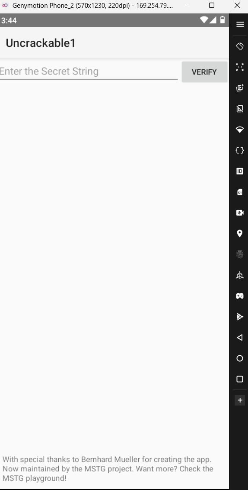
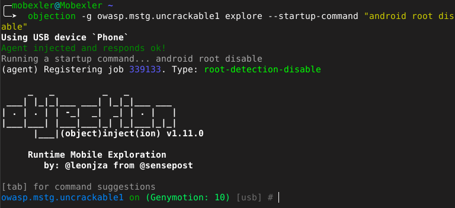
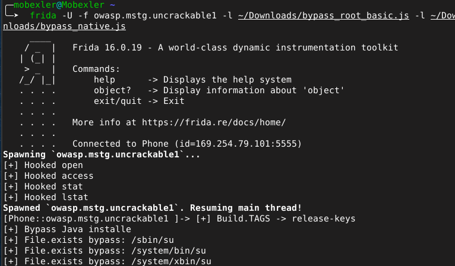

# Lab 14 — Bypass Root Detection : Frida, Objection et Hooks Natifs

## Contexte

Ce lab constitue une synthèse des techniques dynamiques de bypass de
la détection root sur Android. Il couvre trois approches complémentaires :
Frida avec des scripts JavaScript personnalisés, Objection pour une
automatisation rapide, et les hooks natifs pour neutraliser les
vérifications au niveau C/C++. L'application cible est OWASP
UnCrackable Level 1, connue pour ses multiples couches de protection.

---

## Environnement de travail

| Élément | Valeur |
|---------|--------|
| Plateforme | Mobexler (Debian Bullseye) |
| Émulateur | Genymotion — Android 10 (API 29) |
| Architecture | x86 |
| Application | OWASP UnCrackable Level 1 |
| Package | `owasp.mstg.uncrackable1` |
| Frida | 16.0.19 |
| Objection | v1.11.0 |

---

## Étape 1 — Vérification de l'environnement

Les outils Frida et ADB sont vérifiés avant de commencer. La version
du client Frida doit correspondre exactement à celle du frida-server
déployé sur l'émulateur pour éviter tout problème de compatibilité.

```bash
frida --version
python3 -c "import frida; print(frida.__version__)"
adb devices
frida-ps -Uai | head -10
```




---

## Étape 2 — Bypass Java avec Frida

Le script `bypass_root_basic.js` neutralise les trois vérifications
Java principales utilisées par UnCrackable Level 1. Il hook
`Build.TAGS` pour retourner `release-keys`, intercepte `File.exists()`
pour masquer les binaires suspects, et bloque `Runtime.exec()` pour
empêcher l'exécution de `su`.

```bash
frida -U -f owasp.mstg.uncrackable1 \
  -l ~/Downloads/bypass_root_basic.js
```


![Logs [+] bypass Java actifs](screenshots/04-bypass-java-logs.png)


---

## Étape 3 — Bypass avec Objection

Objection simplifie le bypass en une seule commande sans écrire de
script. La commande `android root disable` installe automatiquement
les mêmes hooks que le script Frida manuel, avec en plus des patches
pour des bibliothèques tierces comme RootBeer.

```bash
objection -g owasp.mstg.uncrackable1 explore \
  --startup-command "android root disable"
```



---

## Étape 4 — Hooks natifs avec bypass_native.js

Certaines applications vérifient le root au niveau natif via des appels
système C comme `open()`, `access()` et `stat()`. Le script
`bypass_native.js` intercepte ces appels et retourne `-1` pour les
chemins suspects, empêchant ainsi la détection native.

```bash
frida -U -f owasp.mstg.uncrackable1 \
  -l ~/Downloads/bypass_root_basic.js \
  -l ~/Downloads/bypass_native.js
```



---

## Étape 5 — Analyse avec frida-trace

`frida-trace` permet d'identifier les appels natifs réellement
effectués par l'application. On observe des appels `access()` vers
`/sbin/su`, `/system/sbin/su` et `/system/bin/su` confirmant la
présence de vérifications natives dans UnCrackable Level 1.

```bash
frida-trace -U -f owasp.mstg.uncrackable1 \
  -i open -i access -i stat
```


---

## Comparaison des outils

| Outil | Avantage | Limite |
|-------|----------|--------|
| Frida pur | Contrôle total, hooks personnalisés | Nécessite d'écrire du JS |
| Objection | Une seule commande, rapide | Moins flexible pour cas complexes |
| Hooks natifs | Neutralise C/C++ | Nécessite identification préalable |

---

## Bilan des captures

| # | Fichier | Contenu |
|---|---------|---------|
| 01 | `01-frida-version.png` | Frida 16.0.19 vérifié |
| 02 | `02-frida-ps.png` | Liste des applications |
| 03 | `03-script-created.png` | bypass_root_basic.js créé |
| 04 | `04-bypass-java-logs.png` | Logs [+] Java hooks actifs |
| 05 | `05-after-frida-bypass.png` | App sans alerte via Frida |
| 06 | `06-objection-bypass.png` | Bypass via Objection |
| 07 | `07-native-hooks.png` | Hooks natifs open/access/stat |
| 08 | `08-frida-trace.png` | Appels natifs tracés |

---

## Références

- [Frida — Dynamic Instrumentation](https://frida.re/)
- [Objection — sensepost](https://github.com/sensepost/objection)
- [OWASP UnCrackable Apps](https://github.com/OWASP/owasp-mastg)
- [Android Platform Tools](https://developer.android.com/tools/releases/platform-tools)
