# 🔐 Lab 5 — OWASP UnCrackable Level 2
### Rapport de Reverse Engineering Android

---

## 📋 Informations générales

| Champ | Valeur |
|-------|--------|
| **Application** | UnCrackable-Level2.apk |
| **Plateforme** | Android (Genymotion Phone\_2) |
| **Outils** | Frida 16.0.19, JADX, Ghidra 11.1.2 |
| **Objectif** | Bypass root detection + trouver le secret |
| **Secret** | `Thanks for all the fish` |
| **Date** | 6 Mai 2026 |
| **Auteur** | mobexler |

---

## 🗂️ Structure du projet

```
lab5/
├── UnCrackable-Level2.apk
├── bypass.js
└── uncrackable_l2/
    └── lib/
        ├── arm64-v8a/libfoo.so
        ├── armeabi-v7a/libfoo.so
        ├── x86/libfoo.so          ← utilisé pour Ghidra
        └── x86_64/libfoo.so
```

---

## 📑 Table des matières

1. [Phase 1 — Analyse dynamique & Bypass Root](#phase-1)
2. [Phase 2 — Analyse statique avec JADX](#phase-2)
3. [Phase 3 — Extraction de libfoo.so](#phase-3)
4. [Phase 4 — Analyse avec Ghidra](#phase-4)
5. [Phase 5 — Validation du secret](#phase-5)
6. [Conclusion](#conclusion)

---

<a name="phase-1"></a>
## 🔴 Phase 1 — Analyse dynamique & Bypass Root

### 1.1 Détection du root

Au premier lancement, l'application détecte que l'émulateur est rooté et se ferme immédiatement.

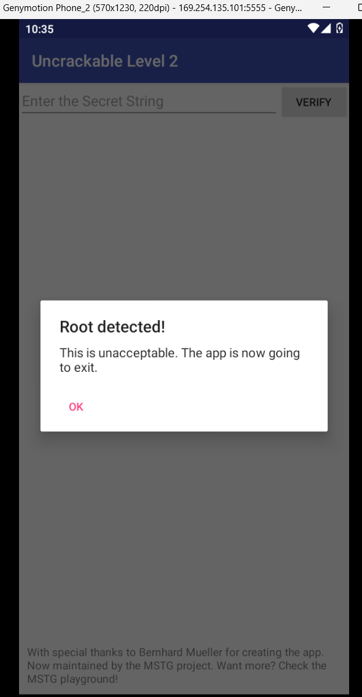

> L'application vérifie trois conditions via `sg.vantagepoint.a.b` : présence de binaires root, propriétés système suspectes, et chemins d'accès root connus.

---

### 1.2 Script de bypass Frida

Création d'un script `bypass.js` qui surcharge les méthodes de détection.

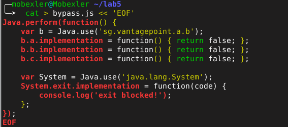

```javascript
Java.perform(function() {
    var b = Java.use('sg.vantagepoint.a.b');
    b.a.implementation = function() { return false; };
    b.b.implementation = function() { return false; };
    b.c.implementation = function() { return false; };

    var System = Java.use('java.lang.System');
    System.exit.implementation = function(code) {
        console.log('exit blocked!');
    };
});
```

---

### 1.3 Lancement de Frida

```bash
frida -U -f owasp.mstg.uncrackable2 -l bypass.js
```

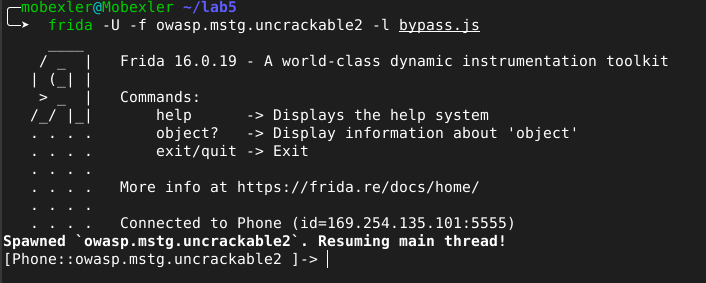

> Frida 16.0.19 connecté à `169.254.135.101:5555` — application spawnée avec succès.

---

### 1.4 Bypass réussi

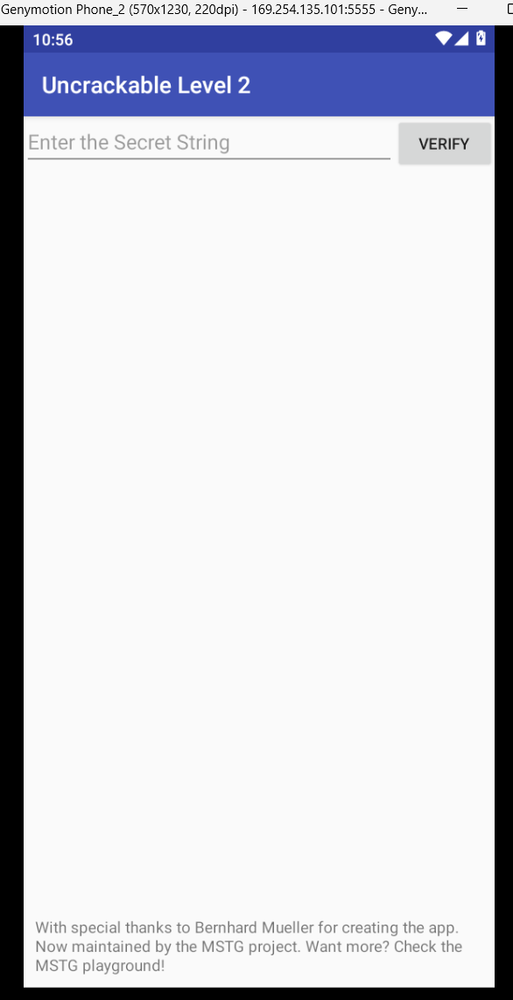

✅ L'interface principale s'affiche sans dialogue de blocage.

---

### 1.5 Test d'une valeur incorrecte

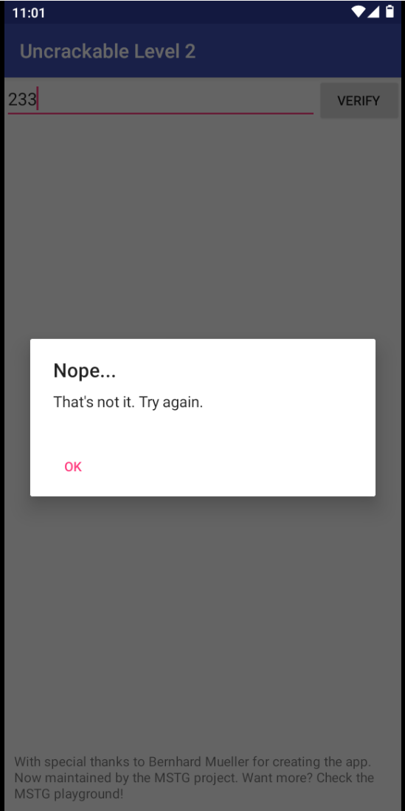

> La vérification du secret est bien active — il faut trouver la bonne valeur.

---

<a name="phase-2"></a>
## 🔵 Phase 2 — Analyse statique avec JADX

### 2.1 Ouverture dans JADX

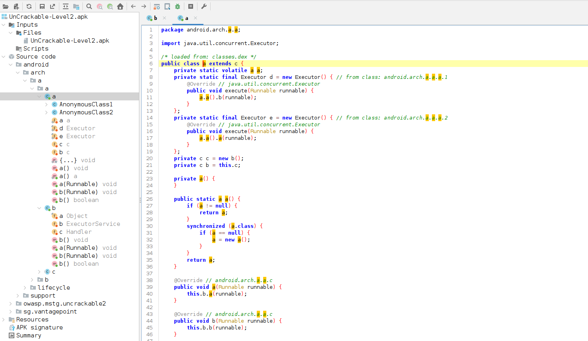

---

### 2.2 MainActivity.onCreate()

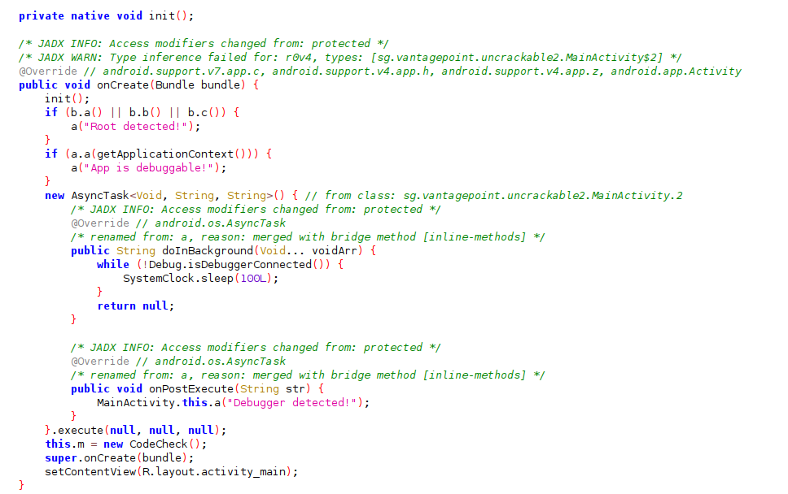

**Protections identifiées :**
- `b.a() || b.b() || b.c()` → détection root
- `a.a(getApplicationContext())` → détection debug
- `AsyncTask` avec boucle sur `Debug.isDebuggerConnected()` → anti-debugger

---

### 2.3 Méthode verify()

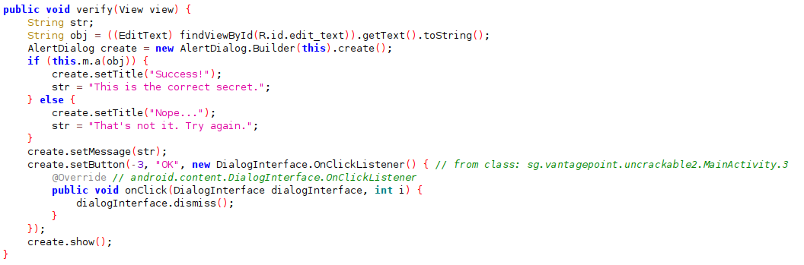

```java
public void verify(View view) {
    String obj = ((EditText) findViewById(R.id.edit_text))
                    .getText().toString();
    if (this.m.a(obj)) {         // délègue à CodeCheck natif
        create.setTitle("Success!");
        str = "This is the correct secret.";
    } else {
        create.setTitle("Nope...");
        str = "That's not it. Try again.";
    }
}
```

---

### 2.4 Découverte de la bibliothèque native

| Capture | Description |
|---------|-------------|
| 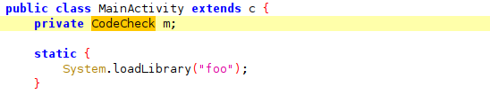 | `private CodeCheck m` — objet natif |
| 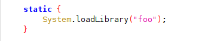 | `System.loadLibrary("foo")` |

> La vérification est déléguée à **`libfoo.so`** — une bibliothèque native C/C++.

---

<a name="phase-3"></a>
## 🟡 Phase 3 — Extraction de libfoo.so

### 3.1 Extraction de l'APK

```bash
unzip UnCrackable-Level2.apk -d uncrackable_l2
```

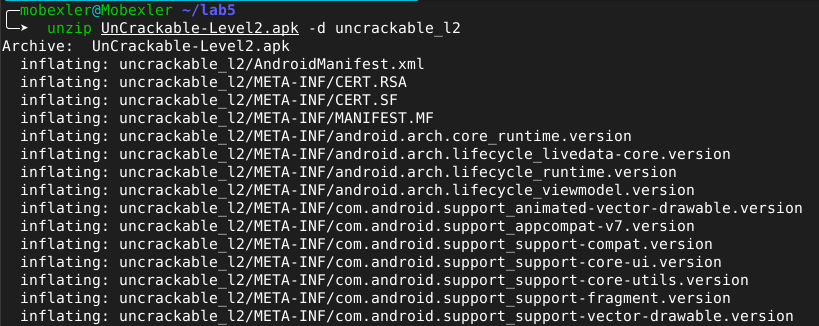

---

### 3.2 Localisation de libfoo.so

```bash
ls -R uncrackable_l2/lib
```

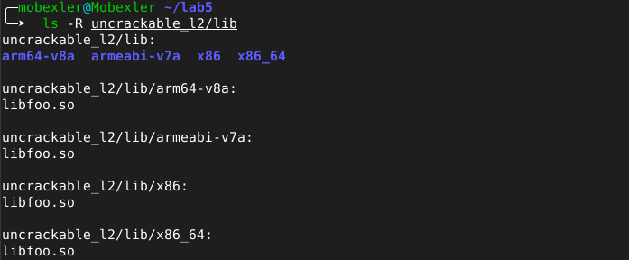

> `libfoo.so` est présent pour 4 architectures. On utilise la version **x86** pour Ghidra.

---

<a name="phase-4"></a>
## 🟣 Phase 4 — Analyse avec Ghidra

### 4.1 Lancement de Ghidra

```bash
cd /opt/ghidra_11.1.2
./ghidraRun
```

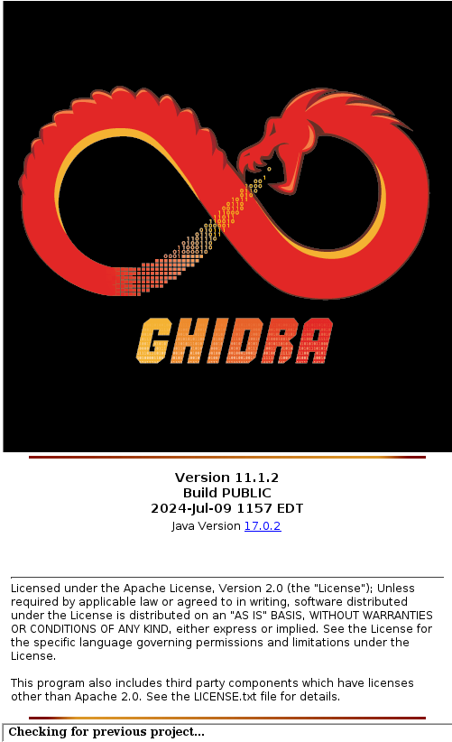

> Ghidra 11.1.2 — Build PUBLIC, Java 17.0.2

---

### 4.2 Import de l'APK

**Sélection du fichier :**

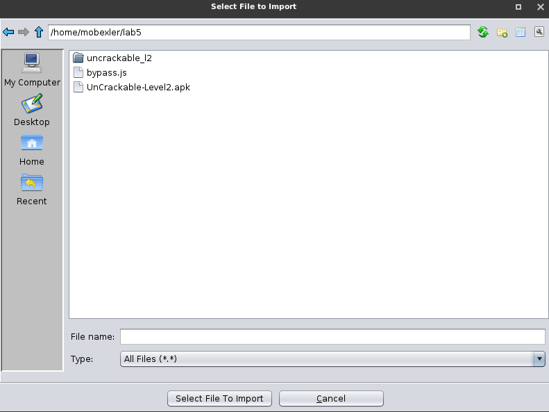

**Configuration — Format Android APK, Language Dalvik DEX Android10 :**

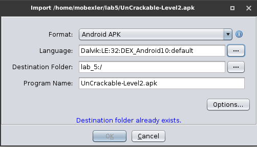

**Résultats — 9344 symboles importés :**

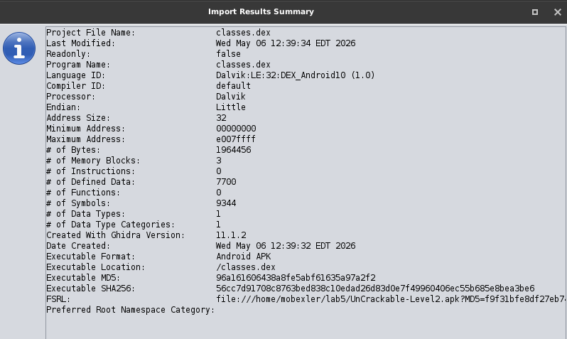

**CodeBrowser sur classes.dex :**

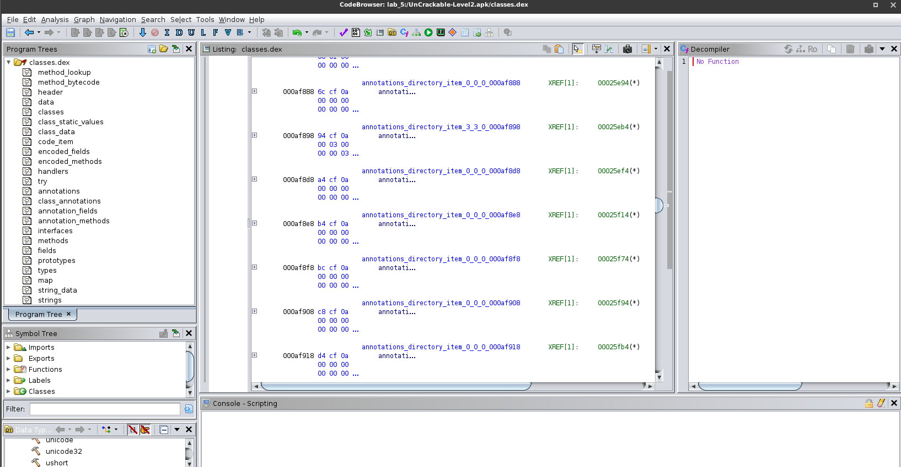

---

### 4.3 Import de libfoo.so

**Format ELF, x86 32bit, gcc :**

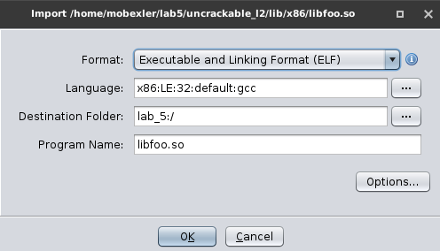

**Résultats — 26 fonctions, 46 symboles :**

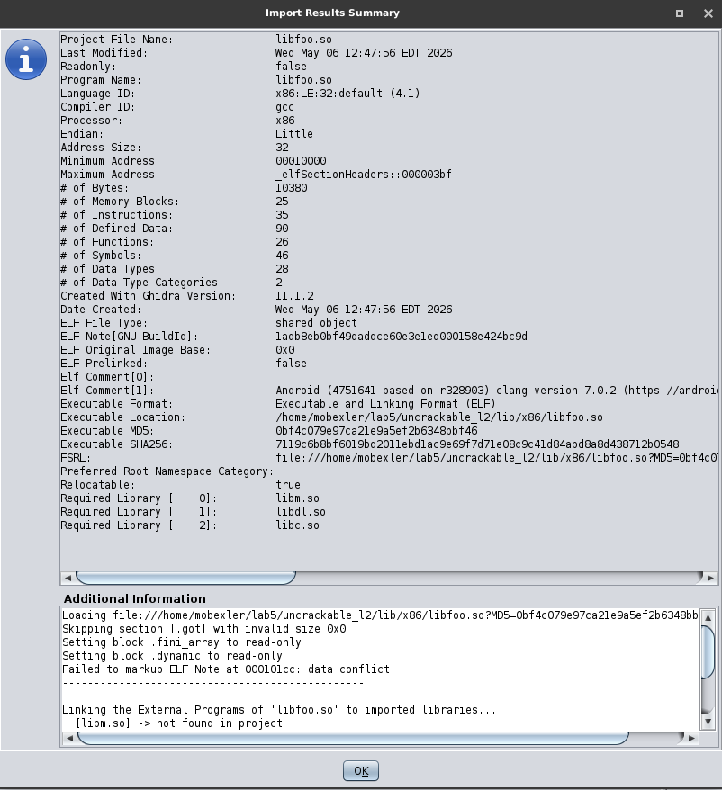

---

### 4.4 Analyse de la fonction CodeCheck

Dans le **Symbol Tree** :
```
Functions → java_sg_vantagepoint_uncrackable2_ → CodeCheck_bar
```

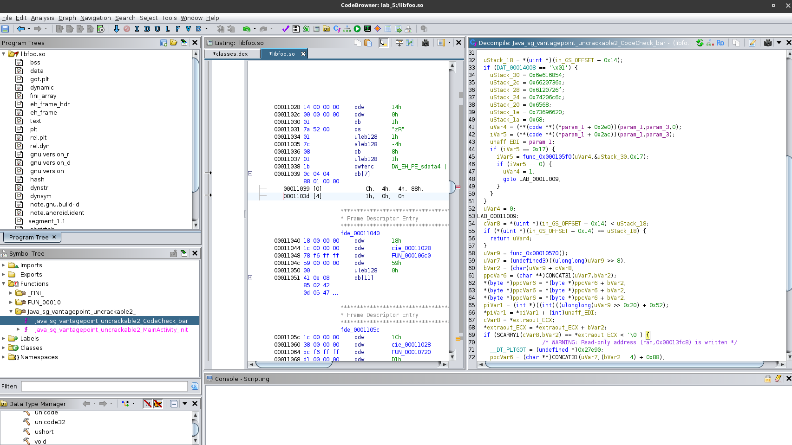

**Points clés du code décompilé :**

| Ligne | Code | Signification |
|-------|------|---------------|
| 44 | `iVar5 == 0x17` | Secret = **23 caractères** |
| 34–40 | Valeurs hex `0x6e616854...` | Secret encodé en mémoire |
| 55 | Comparaison finale | Vérification octet par octet |

**Décodage des valeurs hexadécimales :**

```
0x6e616854  →  "Than"
0x6620736b  →  "ks f"
0x6c206f6f  →  "or a"
0x74206c6c  →  "ll t"
0x20656874  →  "he "
0x68736966  →  "fish"
```

➡️ Secret : **`Thanks for all the fish`**

---

<a name="phase-5"></a>
## ✅ Phase 5 — Validation du secret

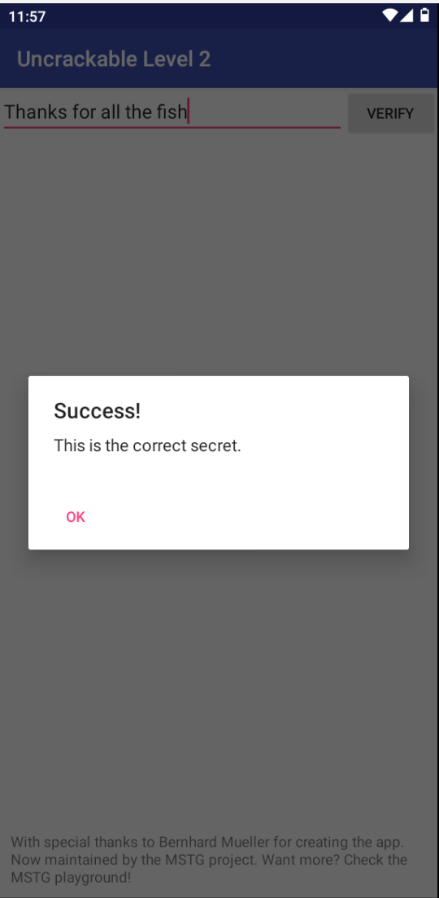

>  **"This is the correct secret."**

**Secret :** `Thanks for all the fish`

> Référence à *"The Hitchhiker's Guide to the Galaxy"* de **Douglas Adams** (1979).

---

<a name="conclusion"></a>
## 📊 Conclusion

### Résumé des étapes

| # | Phase | Outil | Statut |
|---|-------|-------|--------|
| 1 | Bypass root detection | Frida | ✅ Réussi |
| 2 | Bypass debug detection | Frida | ✅ Réussi |
| 3 | Analyse code Java | JADX | ✅ CodeCheck identifié |
| 4 | Extraction libfoo.so | unzip | ✅ Bibliothèque extraite |
| 5 | Analyse binaire natif | Ghidra | ✅ Fonction décompilée |
| 6 | Validation du secret | Genymotion | ✅ Success! |

### Compétences acquises

- ✅ Instrumentation dynamique Android avec **Frida**
- ✅ Décompilation Java avec **JADX**
- ✅ Analyse de bibliothèques ELF natives avec **Ghidra**
- ✅ Compréhension des mécanismes anti-tamper Android
- ✅ Lecture de pseudo-code C décompilé et décodage hexadécimal

---

> *"So long, and thanks for all the fish."* — Douglas Adams
