# 🔐 Lab 17 — OWASP UnCrackable Android Level 3

### Rapport de Reverse Engineering Android

---

## 📋 Informations générales

| Champ | Valeur |
|-------|--------|
| **Application** | UnCrackable-Level3.apk |
| **Plateforme** | Android (Genymotion x86) |
| **Outils** | JADX 1.5.5, apktool 2.9.3, Ghidra 11.1.2, Python 3 |
| **Architecture** | x86 (émulateur Genymotion) |
| **Secret** | `making owasp great again` |
| **Auteur** | Hiba Chagdaly |

---

## 🎯 Objectif

Trouver la chaîne secrète de **24 caractères** cachée dans l'application Android en contournant :
- Détection de root (3 méthodes)
- Vérification d'intégrité CRC des `.so` et du `classes.dex`
- Détection du débogueur (AsyncTask anti-debug)
- Protection anti-Frida dans la librairie native
- Obfuscation LCG + malloc dans la logique native

---

## 📊 Comparaison Level 2 vs Level 3

| Aspect | Level 2 | Level 3 |
|--------|---------|---------|
| Bypass méthode | Frida (dynamique) | Patch smali + .so (statique) |
| Vérif. intégrité | Non | Oui (CRC DEX + .so) |
| Anti-Frida | Non | Oui (dans .so) |
| Obfuscation | XOR simple | LCG + malloc + XOR |
| Taille secret | 23 caractères | **24 caractères** |

---

## 🗂️ Structure du projet

```
lab17/
├── UnCrackable-Level3.apk           # APK original
├── UnCrackable-Level3-patched.apk   # APK patché et signé
├── debug.keystore                   # Keystore de signature
├── libfoo.so                        # Librairie native extraite
├── decode_key.py                    # Script de décodage XOR
├── uncrackable3/                    # APK décompilé (apktool)
│   ├── smali/sg/vantagepoint/uncrackable3/
│   │   └── MainActivity.smali       # Fichier patché
│   └── lib/x86/libfoo.so
└── screenshots/                     # Captures du lab
```

---

## 📸 Phase 1 — Lancement et comportement initial

### Détection root au lancement
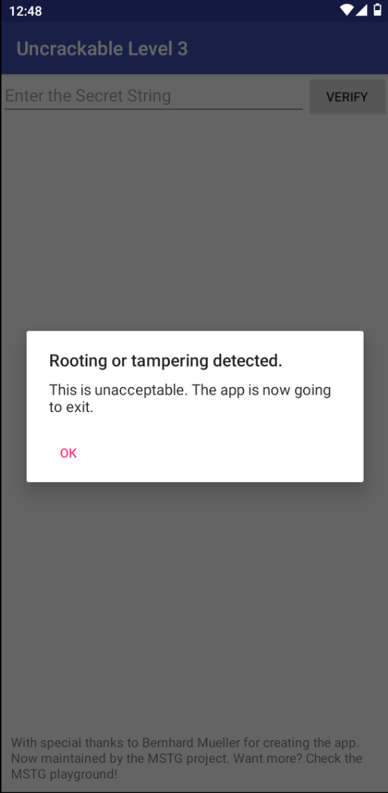
> L'application détecte le root et affiche "Rooting or tampering detected. This is unacceptable." puis quitte.

### Commande ADB de lancement
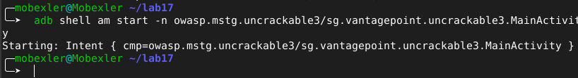

```bash
adb connect 169.254.135.101:5555
adb install UnCrackable-Level3.apk
adb shell am start -n owasp.mstg.uncrackable3/sg.vantagepoint.uncrackable3.MainActivity
```

---

## 🔍 Phase 2 — Analyse statique JADX

### MainActivity — Vue d'ensemble

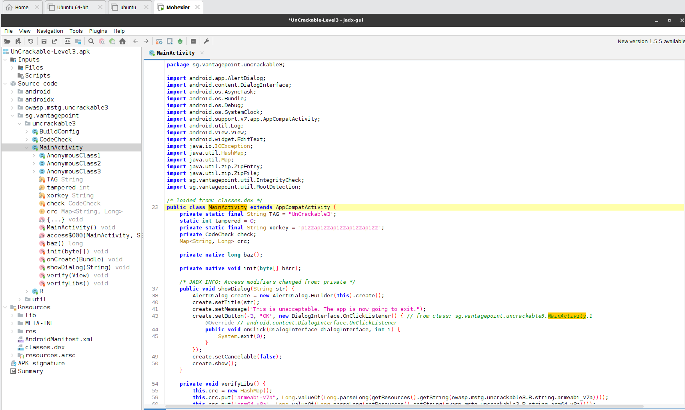

**Éléments clés identifiés :**
- `static int tampered = 0;` → flag de tampering
- `private static final String xorkey = "pizzapizzapizzapizzapizz";` → **clé XOR visible en clair !**
- `private native long baz();` → CRC du DEX en natif
- `private native void init(byte[] bArr);` → initialisation XOR
- `Map<String, Long> crc;` → map des CRC des .so

### Méthode verifyLibs()

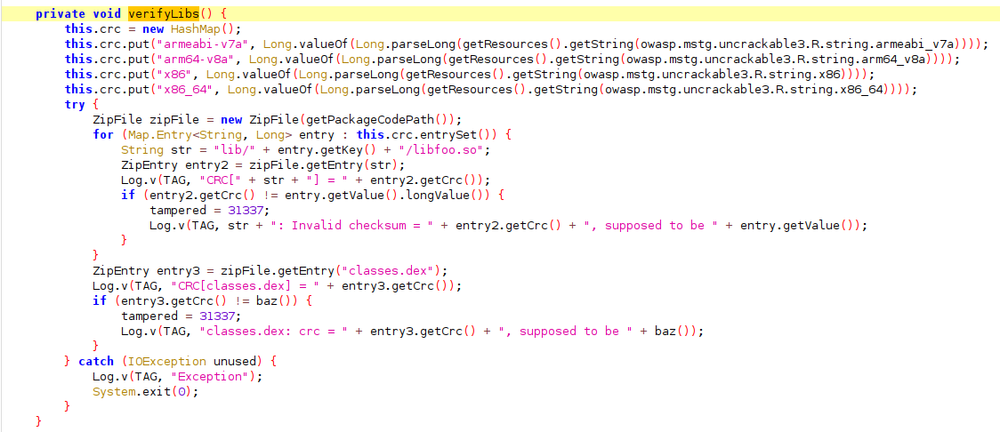

`verifyLibs()` vérifie le CRC de chaque `libfoo.so` (4 architectures) et de `classes.dex`.
Si un CRC ne correspond pas → `tampered = 31337` → popup + exit.

### Méthode onCreate()

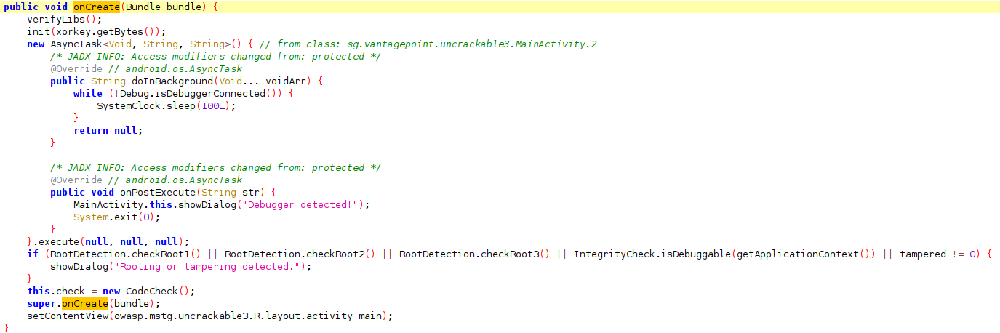

Chaîne de vérifications dans `onCreate()` :
1. `verifyLibs()` → CRC check
2. `init(xorkey.getBytes())` → initialisation native
3. AsyncTask anti-debugger (boucle sur `isDebuggerConnected()`)
4. Check root (3 méthodes) + debuggable + `tampered != 0`

### Méthode verify() + loadLibrary

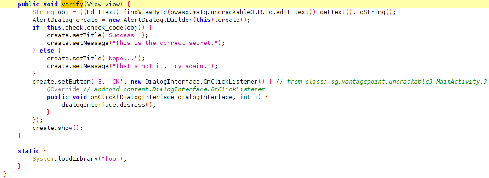

```java
public void verify(View view) {
    String obj = ((EditText) findViewByid(R.id.edit_text)).getText().toString();
    if (this.check.check_code(obj)) {
        // Success!
    }
}
static { System.loadLibrary("foo"); }
```

---

## 🛠️ Phase 3 — Décompilation avec apktool

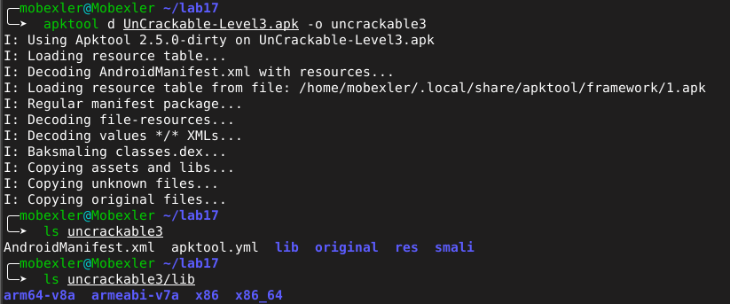

```bash
cd ~/lab17
apktool d UnCrackable-Level3.apk -o uncrackable3
ls uncrackable3/lib/
# → arm64-v8a  armeabi-v7a  x86  x86_64
```

### Architecture de l'émulateur

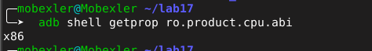

```bash
adb shell getprop ro.product.cpu.abi
# → x86
```

---

## ✂️ Phase 4 — Patch smali

Fichier : `smali/sg/vantagepoint/uncrackable3/MainActivity.smali`

### Avant le patch

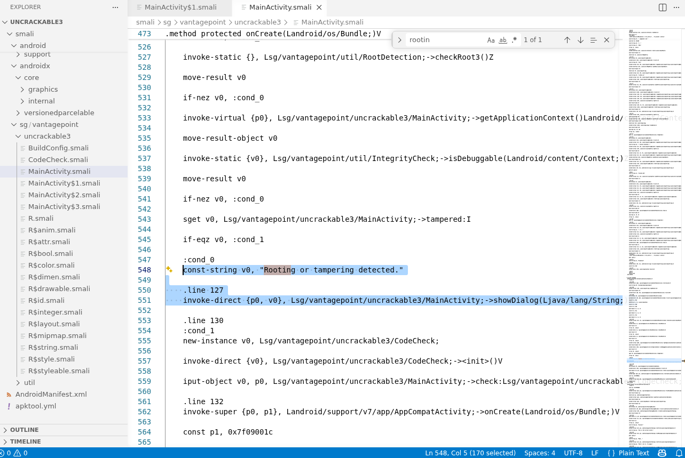

```smali
:cond_0
    const-string v0, "Rooting or tampering detected."
    .line 127
    invoke-direct {p0, v0}, Lsg/vantagepoint/uncrackable3/MainActivity;->showDialog(Ljava/lang/String;)V
```

### Après le patch

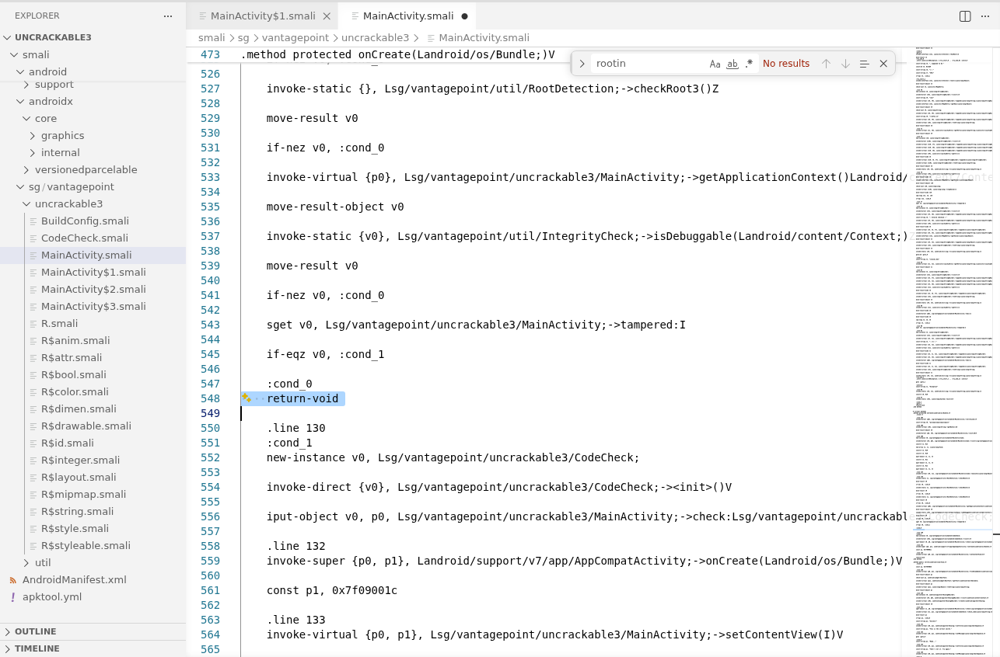

```smali
:cond_0
    goto :cond_1
```

> **Explication :** On redirige vers `:cond_1` (continuation normale) au lieu d'appeler `showDialog()`. Le `super.onCreate()` est préservé, l'app ne quitte plus.

---

## 📦 Phase 5 — Recompilation, Signature, Installation

### Recompilation

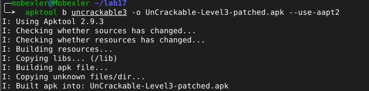

```bash
apktool b uncrackable3 -o UnCrackable-Level3-patched.apk --use-aapt2
```

### Signature

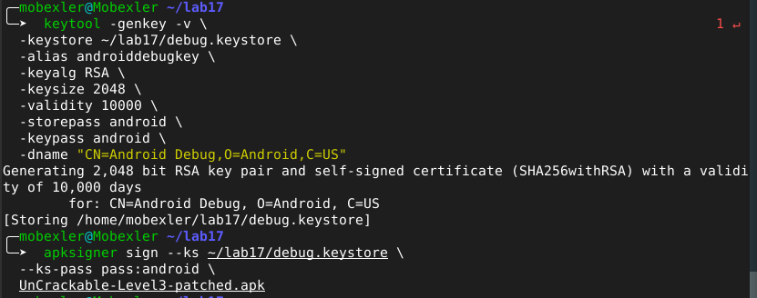

```bash
keytool -genkey -v -keystore ~/lab17/debug.keystore \
  -alias androiddebugkey -keyalg RSA -keysize 2048 -validity 10000 \
  -storepass android -keypass android \
  -dname "CN=Android Debug,O=Android,C=US"

apksigner sign --ks ~/lab17/debug.keystore \
  --ks-pass pass:android UnCrackable-Level3-patched.apk
```

### Installation

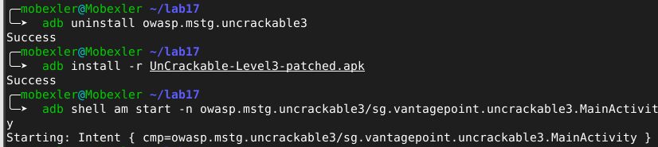

```bash
adb uninstall owasp.mstg.uncrackable3
adb install -r UnCrackable-Level3-patched.apk
```

### Résultat — App sans popup ✅

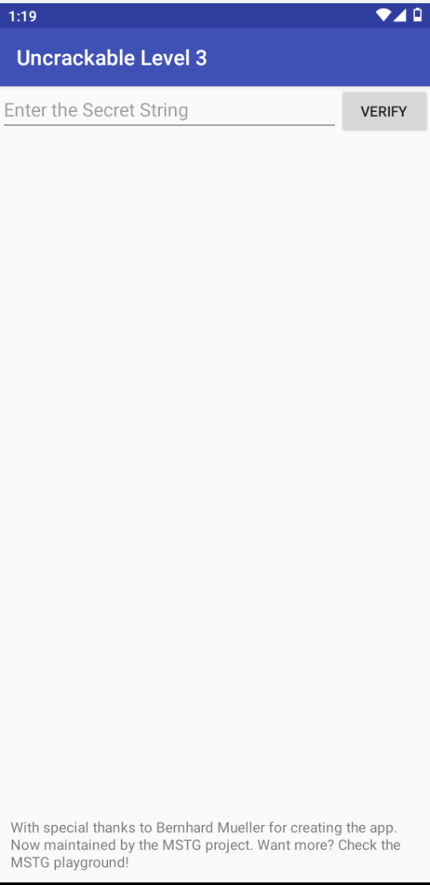

> L'application s'ouvre directement sur le champ "Enter the Secret String" sans popup.

### Test avec valeur incorrecte

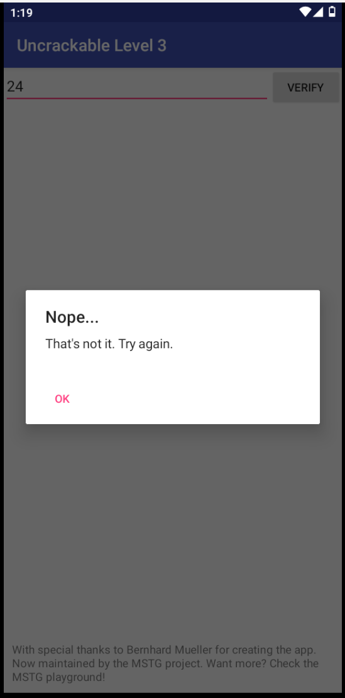

---

## 🔬 Phase 6 — Analyse native avec Ghidra

### Import de libfoo.so

```bash
cp ~/lab17/uncrackable3/lib/x86/libfoo.so ~/lab17/
# Ghidra → File → Import File → libfoo.so
# Format: ELF, Language: x86:LE:32:default (gcc)
```

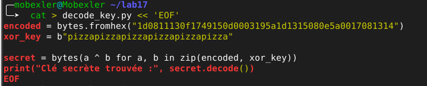

**libfoo.so (Level 3) :** ELF x86 32-bit, 48 fonctions, 75 symboles, compilé avec Android clang 7.0.2

### Fonction CodeCheck_bar

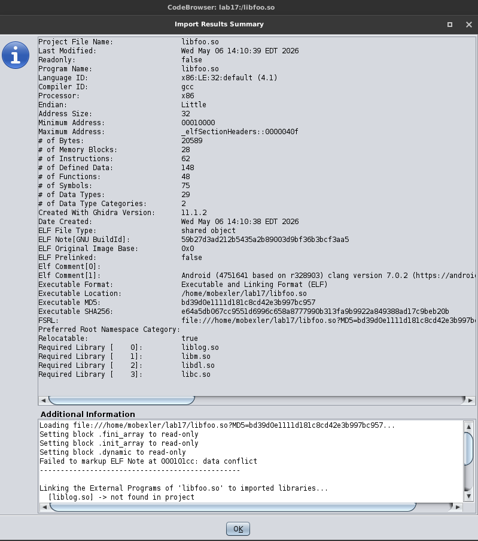

Symbol Tree → Functions → `Java_sg_vantagepoint_uncrackable3_CodeCheck_bar`

### Logique XOR décompilée


```c
// Logique simplifiée
if (DAT_00016038 == 2) {           // Anti-debug flag
    FUN_00010fa0(local_40);        // Init buffer XOR avec "pizza..."
    iVar2 = GetStringLength(...);
    
    if (iVar2 == 0x18) {           // Longueur = 24 caractères
        for (i = 0; i < 0x18; i++) {
            if (input[i] != (encoded[i] ^ key[i]))  // Comparaison XOR
                return 0;  // Échec
        }
        return 1;  // Succès
    }
}
```

| Élément | Valeur |
|---------|--------|
| `DAT_00016038` | Flag anti-debug (doit être 2) |
| `iVar2 == 0x18` | Longueur secret = **24 caractères** |
| `DAT_0001601c` | 24 octets encodés (secret chiffré) |
| Clé XOR | `pizzapizzapizzapizzapizz` (depuis Java) |

---

## 🐍 Phase 7 — Décodage Python

```python
encoded = bytes.fromhex("1d0811130f1749150d0003195a1d1315080e5a0017081314")
xor_key = b"pizzapizzapizzapizzapizzapizza"

secret = bytes(a ^ b for a, b in zip(encoded, xor_key))
print("Clé secrète trouvée :", secret.decode())
```

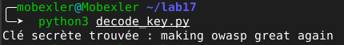

```
Clé secrète trouvée : making owasp great again
```

---

## 🎉 Validation — Success!

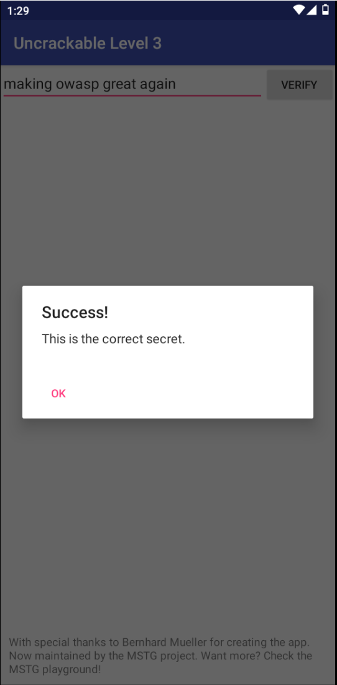

> **"Success! This is the correct secret."** ✅

---

## ✅ Récapitulatif

| # | Phase | Outil | Statut |
|---|-------|-------|--------|
| 1 | Analyse statique Java | JADX | ✅ |
| 2 | Décompilation APK | apktool | ✅ |
| 3 | Patch smali (bypass root) | VS Code | ✅ |
| 4 | Recompilation + Signature | apktool + apksigner | ✅ |
| 5 | Analyse librairie native | Ghidra | ✅ |
| 6 | Décodage XOR | Python 3 | ✅ |
| 7 | Validation secret | Genymotion | ✅ |

**🔑 Secret : `making owasp great again`**

---

## 📚 Captures — Index complet

| Fichier | Description |
|---------|-------------|
| `01_app_root_detected.png` | Popup root détecté au lancement |
| `02_adb_start_mainactivity.png` | Commande ADB de lancement |
| `03_jadx_mainactivity_top.png` | JADX — MainActivity + xorkey |
| `04_jadx_verifylibs.png` | JADX — verifyLibs() CRC check |
| `05_jadx_oncreate.png` | JADX — onCreate() détections |
| `06_jadx_verify_method.png` | JADX — verify() + loadLibrary |
| `07_apktool_decompile.png` | Décompilation apktool |
| `08_architecture_x86.png` | Architecture émulateur x86 |
| `08_smali_avant_patch.png` | Smali avant patch |
| `09_smali_apres_patc.png` | Smali après patch |
| `10_apktool_build.png` | Recompilation réussie |
| `11_apksigner_sign.png` | Keystore + signature APK |
| `12_adb_install.png` | Installation via ADB |
| `13_app_sans_popup.png` | App ouverte sans popup ✅ |
| `14_valeur_incorrect.png` | Test valeur incorrecte |
| `15_ghidra_codecheck_bar.png` | Ghidra Symbol Tree |
| `16_ghidra_decompiler_xor_logic_.png` | Logique XOR décompilée |
| `17_ghidra_libfoo_import.png` | Import Results libfoo.so |
| `18_python_decode_result.png` | Script Python + résultat |
| `19_success_making_owasp_great_again.png` | Success! dans l'app |

---

*Sécurité des Applications Mobiles — MLIAEdu | Hiba Chagdaly | Mai 2026*
